# Best Practices with Fabric CI/CD

Microsoft Fabric is a unified analytics platform designed to bring
together different data and analytics tools into a single, integrated
software-as-a-service (SaaS) solution. Fabric caters to data engineers,
data scientists, and analysts who need to collaborate on analytics and
AI projects. The Fabric platform adds value by reducing complexity while
still making it possible to build, deploy and manage enterprise-scale
projects focused on analytics and AI.

The Microsoft Fabric platform attracts people with different technical
backgrounds. For example, there are data engineers tasked with creating
notebooks to ingest and transform data to populate lakehouse tables.
There are data modelers tasked with building and refining semantic
models on top of lakehouse tables. There are report designers tasked
with authoring and updating Power BI reports that are built on top of
those semantic models. Once you understand how CI/CD works in Fabric,
you will be able to enable collaboration allowing all these people to
continually update their part of a Fabric project without stepping on
anyone else’s work.

This guidance is intended for technical professions who plan to build
end-to-end solutions on the Fabric platform. This audience includes data
engineers, release managers, Fabric administrators and professional
developers. This guidance explains how to setup the infrastructure for a
Fabric CI/CD project and how to deploy and manage the CI/CD lifecycle of
workspace items such as lakehouses, notebooks, pipelines, semantic
models and reports. The goal is to build your conceptual understanding
of the Fabric CI/CD infrastructure enabling you to build a scalable
development process for continuous integration as well as a fast and
reliable release process for continuous deployment.

## Fabric CI/CD Background

Before learning about CI/CD capabilities built into Fabric, you should
understand a few background topics. This section will start with a quick
review of the concepts and terminology used in traditional CI/CD. It
will also explain the different between a Fabric solution and a Fabric
CI/CD project.

### Traditional CI/CD Fundamentals

CI/CD represents a set of core principles and best practices that have
been widely adopted across the software industry. The goal of CI/CD is
to streamline and accelerate the lifecycle of software development.
CI/CD focuses on two different aspects of managing the application
lifecycle which are continuous integration (CI) and continuous
deployment (CD)**.**

**Continuous integration (CI)** is the practice of merging code changes
into a shared repository on a regular basis. Each time developers merge
their changes, it can trigger automated workflow processes that ensure
the application source code as a whole still works together by running
validation tests. Continuous integration makes it possible to detect
bugs early on. This, in turn, makes it possible to maintain a codebase
that's always in a working state and ready to deploy to production.

Continuous integration is popular because it allows a team of developers
to work on the same application at the same time. CI/CD solves the
challenging problem of integrating the work of multiple developers into
a shared codebase in an ongoing basis. Once you have designed and
implemented a GIT branching strategy, you’ll be able to merge
everybody’s changes together in a structured development process that
maintains code quality while also getting updates and new features into
production as quickly as possible.

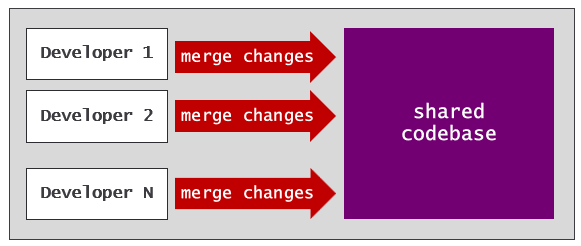

**Continuous deployment (CD)** is the practice of automating the
deployment of code. Deployment is often preceded by some type of manual
approval process in which one or more approvers must sign off on a
release. Once a release has been approved, a continuous deployment
process is automatically triggered to deploy these changes to a target
environment.

With continuous deployment, you can build automated processes to route
the lifecycle of application code through a sequence of environments.
Promoting code changes through environments enables enhanced testing and
for manual approval processes that ensure only high quality code reaches
production. The release process in a CI/CD lifecycle is often built to
promote changes through a standard set of environments such as **dev**,
**test** and **prod**.

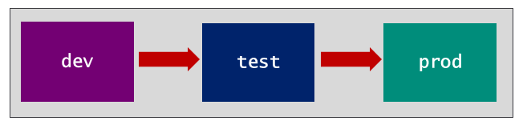

### Fabric solutions

The way that you provide value to users on the Fabric platform is by
building Fabric solutions. You build a Fabric solution by creating a
composition of workspace items such as variable libraries, lakehouses,
notebooks, pipelines, semantic models and reports. The Fabric platform
currently offers 35 distinct workspace items types to chose from when
designing a solution and that number is continually growing.

One important decision you must make when designing a Fabric solution is
how many workspaces it requires to run. In many scenarios, a Fabric
solution can be designed to run inside a single workspace. The following
screenshot shows a simple example of a Fabric solution with five
workspace items designed to run within a single workspace.

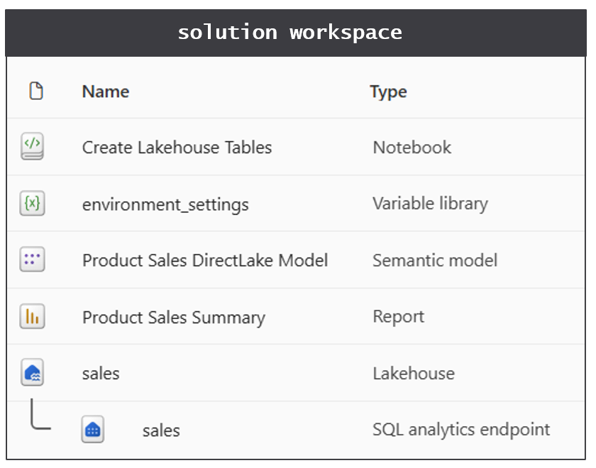

When building a Fabric solution with a large number of items, you can
partition items using workspace folders. Workspace folders can assist
with organizing items by role or by type. The use of workspace folders
also helps to declutter the top-level folder which is the default view
for business users.

There are scenarios where it's either impractical or impossible to
deploy all the items for a Fabric solution to a single workspace. For
example, Fabric imposes a limitation of 1000 items per workspace. If you
build a Fabric solution with more than 1000 items, your must design the
solution to span two or more workspaces. There can also be design
factors or requirements with respect to security, least privilege and
item ownership which can lead you to designing a Fabric solution with
multiple workspaces.

Let's look at an example of a Fabric solution design which requires
multiple workspaces. Imagine you are designing a Fabric solution with a
medallion architecture and you're given the security requirement to
prevent business form accessing staging data in the bronze lakehouse and
the silver lakehouse. Keep in mind that workspace folders inside a
single workspace cannot be used to configure security. When you
configure access for users by adding a workspace role assignment, the
users then can access anything inside. The best way to enforce the
security requirement is to design the Fabric solution with a staging
workspace and a presentation workspace.

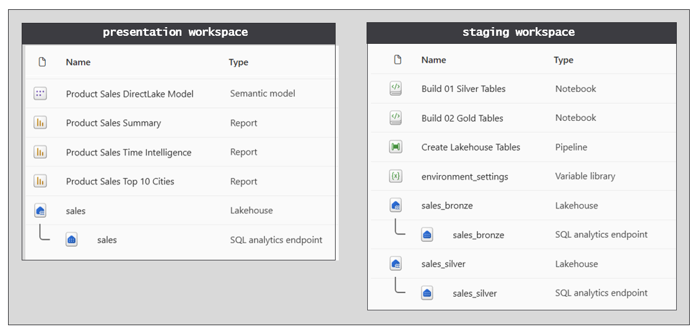

The staging workspace is designed to include all the items used to run
ETL jobs and to store staging data. The presentation workspace is
designed with the items which are intended for access by business users.
After deploying this Fabric solution, you can configure access to each
workspace independently. Now you can add a workspace role assignment to
the presentation workspace for business user who need access reports,
the semantic model and the gold lakehouse without providing access to
anything in the staging workspace.

### Fabric CI/CD projects

Imagine a scenario in which you have prototyped a Fabric solution using
the platform's analytics and AI capabilities. You then shared the
solutions with a few peers for review and you received positive
feedback. After that, you were given the opportunity to present your
Fabric solution to the leadership team. The leadership team loved it. In
fact, they were so impressed that decided to 'productionize' your Fabric
solution so it can be rolled out to a large audience of business users.
This is the moment that a Fabric CI/CD project begins.

A Fabric CI/CD project involves applying the concepts of CI/CD to a
Fabric solution. While the term Application Lifecycle Management (ALM)
is widely used, it’s probably better to think about Fabric CI/CD as
Solution Lifecycle Management (SLM). For example, you need to stand up
multiple environments and get an instance of the Fabric solution running
in each one. You also need to build the CI/CD processes to propagate
solution updates from one environment to the next.

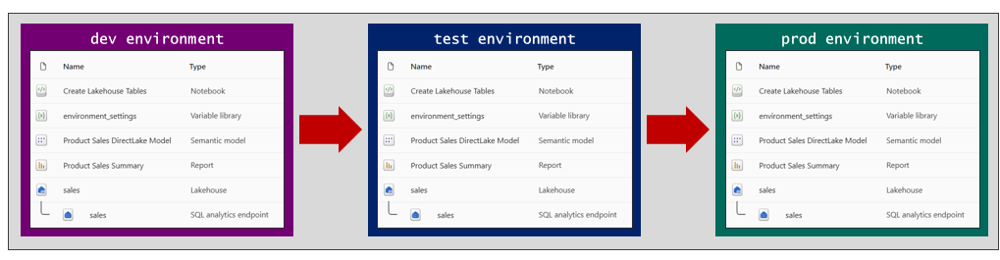

One essential aspect of planning a Fabric CI/CD project involves
defining the requirements for the project's environments. The way to
create an environment is by assembling a set of resources so you have a
place to deploy and run the Fabric solution. At a minimum, an
environment for Fabric solutions requires a workspace which is assigned
to a Fabric capacity. In a project where the Fabric solution requires
two workspaces, then you will need two workspaces per environment.

Another important considerations during the planning phase is whether
each environment requires it own separate capacity. While you can assign
workspaces from all environments to a single shared capacity, it's
considered a best practice to isolate environments by creating a
separate Fabric capacity for each one as shown in the following diagram.

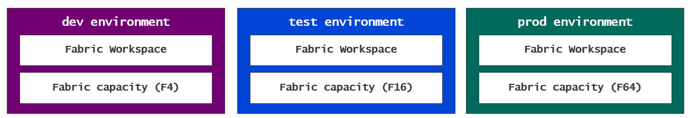

The Fabric CI/CD project examples in in this guidance use three
environments named **dev**, **test** and **prod**. However, the
environments you plan in your project can use other popular environment
names such as **qa**, **uat** or **ppe**.

When planning the environments for a Fabric CI/CD project, you might
decide to include other types of Azure resources as well. For example,
you can design a Fabric solution to access data files from an Azure
storage account. In this type of scenario, it makes sense to plan on
creating a separate Azure storage account for each environment.

Remember that a primary motivation for environments is the ability to
run a Fabric solution using different datasources for development,
testing and production. During the environment planning phase you should
map out all URLs and paths used to connect to external datasources. This
guidance will explain best practices for implementing a parameterization
strategy so that Fabric items in each environment connect to their
environment-specific datasources.

## Fabric CI/CD Capabilities

The Fabric platform provides the following capabilities to assist with
building CI/CD processes.

- GIT Integration
- Branched workspaces
- Variable libraries
- Workspace Item Types
- Item Definitions
- Deployment Pipelines

This section will drill into each of these Fabric CI/CD capabilities
along with a few other related topics. The goal is for you to build your
understanding of how these pieces fit together before you move ahead to
learn about Fabric automation and workflow development.

### GIT Synchronization

The Fabric CI/CD infrastructure starts with its support for GIT
integration. Imagine you’re on a team building a data analytics solution
based on a Fabric workspace that includes a lakehouse, notebook,
semantic model and report. Fabric makes it possible to maintain the
source code for all four workspace items as a single source of truth in
a GIT repository. Any updates made to workspace items can be versioned,
tracked and compared to other versions.

> Fabric's list of supported GIT providers includes **Azure DevOps**,
**GitHub** and **GitHub Enterprise**. Microsoft is currently planning to
add other popular GIT providers in the future. You can find the most
up-to-date information about Fabric's support for GIT providers and
their limitations by reading [**Supported Git
providers**](https://learn.microsoft.com/en-us/fabric/cicd/git-integration/intro-to-git-integration?tabs=azure-devops#supported-git-providers).

Fabric’s support for GIT integration is enabled at workspace scope. More
specifically, you enable GIT integration by connecting a workspace to a
branch in a GIT repository. There are two steps required to connect a
workspace to a branch in GIT. The first step is to create a Fabric
connection to the target GIT repository. The second step is to configure
a workspace-level setting which connects the workspace to a specific
branch inside the GIT repository.

Fabric provides the **Azure DevOps - Source control** connector for
connecting to Azure Dev Ops repositories. When creating a connection
using **Azure DevOps - Source control** connector, you must configure
connection credentials using an Entra Id identity which can be either a
user principal or a service principal. Fabric provides the **GitHub -
Source control** connector for connecting to repositories in GitHub and
GitHub Enterprise. When creating a connection using **GitHub - Source
control** connector, you must you must configure the connection
credentials using a personal access token (PAT).

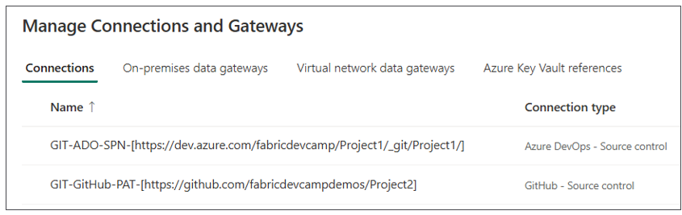

An essential aspect of Fabric GIT integration is its ability to
dynamically generate item definitions from workspace items. When you
connect a workspace to a branch in a GIT repository, Fabric runs a
**Commit to GIT** operation which generates an item definition for each
item and persists the item definition to the target GIT branch as a
folder containing item definition files.

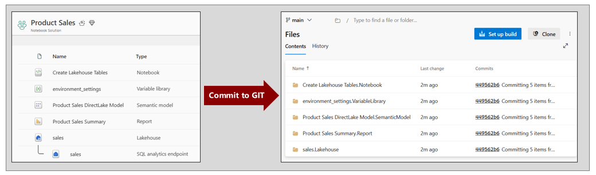

Fabric uses a naming convention for item definition folders which
includes the item display name, a period and the item type in the format
of **\[Item Display Name\].\[Item Type\].** You can see from the
previous screenshot that GIT synchronization creates folders using this
naming convention for folder names such as **sales.Lakehouse** and
**Product Sales Summary.Report**.

Once a workspace is connected to and synchronized with a GIT branch, the
Fabric workspace List view displays a **GIT status** column that
displays **Synced** to indicate all workspace items are in sync with the
underlying item definitions stored in GIT.

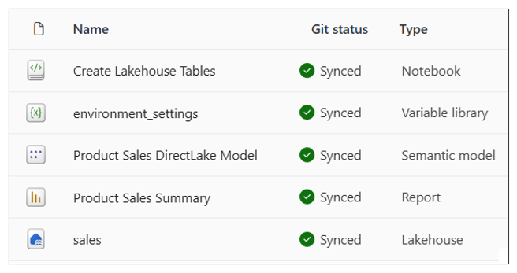

Fabric GIT integration also makes it possible to synchronize changes in
the other direction. Think about a scenario in which all the items in a
workspace are synchronized with a GIT branch. After that, new changes to
an item definition are merged into the branch from another branch. You
can run an **Update from GIT** operation to synchronize changes from
item definitions in GIT to the items in the workspace.

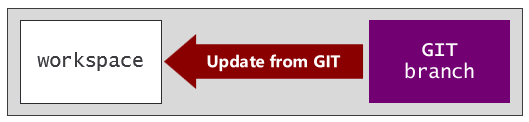

When you run an **Update from GIT** operation, Fabric checks to see
whether a target items already exists for each item definition by
checking for a match with the item display name and type. In the case
where Fabric finds a matching item, it update the existing item to
ensure it is kept in sync with the item definition. But what happens
when Fabric cannot find an existing item to match an item definition in
GIT? The answer is that Fabric uses the item definition to create a new
item.

Consider a scenario in which you connect a GIT branch containing item
definitions to an empty workspace and run an **Update from GIT**
operation. Fabric creates a new item from each item definition in GIT.
This leads to an important observation about GIT integration in Fabric.
If you have a GIT branch which contains the item definitions for Fabric
solution, you can use that GIT branch to deploy the solution to a target
workspace.

### GIT folder settings

When you use the Fabric UI to configure a connection between a workspace
and a GIT branch, you are given the option to add a **Git folder**
settings. If you leave the **Git folder** setting with its blank default
value, Fabric GIT synchronization will create the item definition
folders in the root folder of the target GIT branch. By adding a GIT
folder settings, you can configure GIT synchronization to write its
output to a child folder in the GIT branch instead of the root folder.

There are two important scenarios in which it's important to configure a
**Git folder** setting. The first scenario involves any Fabric CI/CD
project which requires adding workflow files such as YAML files and
Python files into the same GIT repository. By configuring a **Git
folder** setting, you can avoid the confusion mixing the item
definitions files for workspace items together with other project files.
The following screenshot shows the effect of configuring the **Git
folder** setting with a value of **/workspace**.

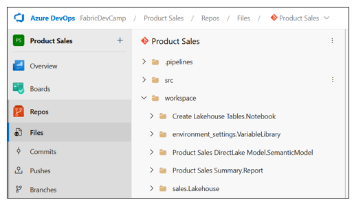

> The [**Git -
Connect**](https://learn.microsoft.com/en-us/rest/api/fabric/core/git/connect?tabs=HTTP#azuredevopsdetails)
API provides the **directoryName** parameter which you can use to
configure the **Git folder** setting.

The second scenario where it's important to configure the **Git folder**
setting involves a Fabric solution spread across multiple workspaces.
Let's revisit the Fabric solution introduced earlier with a medallion
architecture. The solution was designed with two workspaces to separate
ETL logic from presentation. There is a staging workspace which contains
notebooks and lakehouses for staging bronze and silver layer data and a
presentation workspace containing the gold layer lakehouse, a semantic
model and a report.

While it is possible to connect each workspace to its own separate GIT
repository, that is a bad idea. Instead, you need an approach that
results in creating a single source of truth in GIT for the Fabric
solution as a whole. This remains true even when the solution spans
multiple workspaces. The best practice is to synchronize both workspaces
in a single GIT branch in the same repository. This is possible as long
as you use a different **Git folder** setting for each workspace.

As an example, you can connect the staging workspace to the GIT branch
with **a Git folder** setting of **/workspace/staging**. You can connect
the presentation workspace to the same GIT branch with a Git folder
setting of **/workspace/presentation**. This design is essential for
Fabric solutions with multiple workspaces because it effectively creates
a single source of truth in GIT for the solution as a whole.

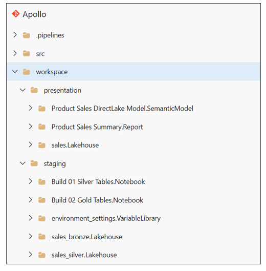

### Feature Workspaces
The use of features branches has become widely adopted in software
development. A development process based on feature branches allows
developers to work and commit changes in isolation. You can also
configure a feature branch with workflows that are triggered whenever
changes are committed. These workflows can automate running tests with
linters, validation checks and security scans as part of the continuous
integration process to improve the quality of code that reaches
production.

After committing changes to a feature branch, the next step is to create
a **pull request** to merge those changes to the shared branch. You can
think of a pull request as a proposal that allows collaborators and
release managers to review a set of changes. GIT providers such as Azure
DevOps and GitHub make it possible to configure pull requests with
manual approval processes that are as simple or as complex as required
for a given scenario. When the approval process for a pull request
completes, the changes are automatically merged to the shared branch
which is known as the integration branch.

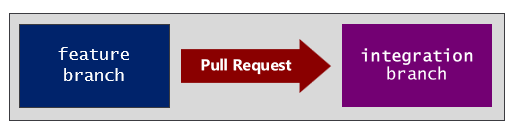

The **integration branch** is an essential concept in continuous
integration. The integration branch is the shared branch where the
changes of all developers are merged together. It's called the
*integration branch* because its contents represent the single source of
truth that is always ready for deployment to test environments and
production environments. Remember that the integration branch is a
concept not a name. An integration branch typically has a name such as
**main** or **dev**.

> Creating and managing pull requests
> - [Create pull requests in Azure Dev Ops](https://learn.microsoft.com/en-us/azure/devops/repos/git/pull-requests?view=azure-devops&tabs=browser)
> - [Creating a pull request in GitHub](https://docs.github.com/en/pull-requests/collaborating-with-pull-requests/proposing-changes-to-your-work-with-pull-requests/creating-a-pull-request)

For developers migrating to Fabric with experience in traditional CI/CD,
some aspects of Fabric CI/CD will be familiar while other aspects will
not. For example, these developers may already be familiar with creating
feature branches and pull requests. However, things are different in
Fabric CI/CD because each feature branch must be matched up and
connected to a feature workspace.

Let's walk through the high-level steps to build a development process
for Fabric CI/CD project using feature workspaces. The first step is to
create a single source of truth in GIT. For this you need to create a
GIT repository and you need to determine which branch will serve as the
integration. After that, you can create the single source of truth by
creating a set of item definitions in the integration branch.

While there are several approaches you can use to create the initial set
of item definitions in the integration branch, a common approach
involves getting a version of the Fabric solution up and running in a
**dev** workspace. This makes it possible to connect the **dev**
workspace to the integration branch and run a **Commit to GIT**
operation. The **Commit to GIT** operation creates an item definition in
the integration branch for each item in the dev workspace.

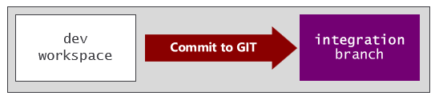

When you run a **Commit to GIT** operation to create item definitions in
the integration branch, this should be considered a one-time operation.
Once you have created the item definitions which represent the single
source of truth, you should refrain from directly updating items or
running **Commit to GIT** operation in the **dev** workspace. Instead,
future changes should be merged from feature branches to the integration
branch. This disciple can be enforced by configuration the integration
branch in GIT with a branch policy that only allows updates through pull
requests.

Once the integration branch has been configured as a single source of
truth, you can begin to create feature workspaces. This process involves
two steps. First, you create a new feature branch based on the
integration branch. After that, you create a new workspace and connect
it to the feature branch and run an **Update from GIT** operation. This
flow will automatically populate the feature workspace with a matching
set of workspace items.

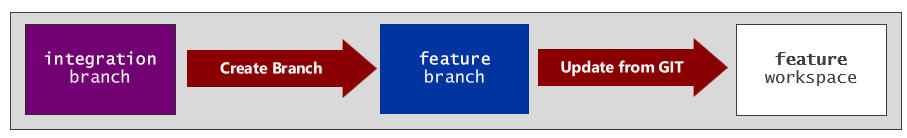

When you initialize a feature workspace with an **Update from GIT**
operation, you're often required to complete additional configuration
steps before it's ready for development. This topic will be revisited
shortly in the discussion of automation.

Once you standardize on a process for creating feature workspaces, you
can begin to build what's required for continuous integration. The
following diagram shows a development process built using feature
branches and feature workspaces. This is an approach which can scale to
accommodate a larger number of developers or development teams.

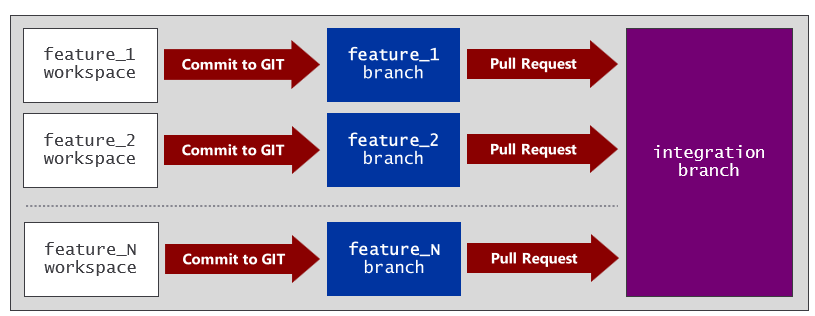

Keep in mind that feature branches should be short-lived. You don't want
a feature branch hanging around too long because that increases the risk
of merge conflicts with the integration branch. It's a common practice
to delete a feature branch as soon as a pull request completes and
merges its changes to the integration branch.

When it comes to managing the lifecycle of feature workspaces, you have
two options. The first option is to manage the feature workspace
lifecycle to coincide with feature branches. When using this approach,
you delete the feature workspace and the feature branch at the same time
after the pull request completes and its changes have been merged.

A second option is recycle feature workspaces by reusing them across
pull requests. For example, you can create a feature workspace for a
specific developer or development team working in a particular area. As
an example, you can create a dedicated feature workspace for the Spark
team writing ETL logic in notebooks to build lakehouses tables. You can
create a second feature workspace for the data modeling team working
with semantic models. You can create a third feature workspace for the
analytics teams who will be continually updating reports.

### Branched Workspaces

Fabric offers branched workspaces to assist with creating and managing
feature workspaces. Fabric support for branched workspaces offers a
streamlined user experience which simplifies creating feature workspaces
and switching between feature branches. Building out the development
process using branched workspaces enhances productivity because Fabric
is able to create new GIT branches and managing GIT connections behind
the scenes.

Consider a scenario in which the **dev** workspace is connected to an
integration branch named **main** in a GIT repository. If you navigate
in the **dev** workspace to the **Branches** panel of the **Source
control** pane, you can find a set of branching commands which include
**Branch out to workspace**.

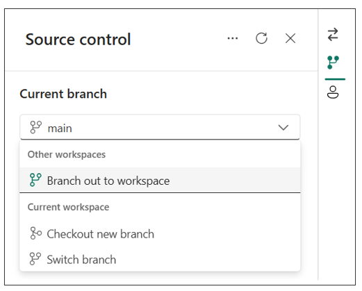

When you run the **Branch out to workspace** command, Fabric prompts you
with a dialog to enter a new branch name. The **Branch out to
workspace** dialog also allows you to choose between creating a new
feature workspace or connecting to an existing feature workspace.

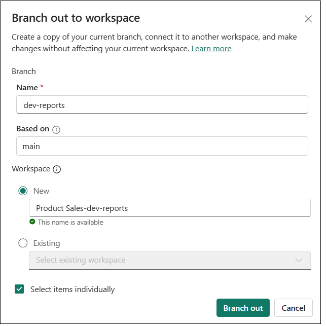

The **Branch out to workspace** dialog provides an option to **Select
items individually** to enable a capability known as selective
branching. If you select this option and click the **Branch out**
button, you will be prompted with another dialog which allows you to
select which items to include in the branch out process.

Selective branching is particularly useful in scenarios which include
workspaces containing a large number of items. It can take a long time
to run a full branch out process when the **dev** workspace that
contains 100s of items. Selective branching allows you to complete the
branch out process much faster in a case where you only need to work on
a small subset of items. After the initial branch out, you can also
incrementally add other items to the branched workspace as needed.

When you branch out to a feature workspace, Fabric creates a
relationship between the branched workspace and the shared **dev**
workspace connected to the integration branch. This makes it easier to
visualize the high-level development process for a Fabric CI/CD project.
If you navigate the **Related Branches** view in the **Source control**
pane, you can see the top navigation node in the hierarchy displays the
integration branch named **main** and the name of the shared **dev**
workspace. Each child node displays the name of each feature workspace
along with its underlying GIT branch name.

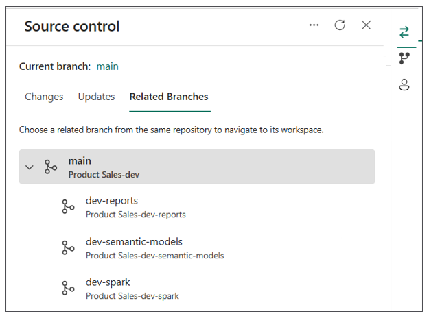

Within each branched workspace, Fabric also provides a workspace
breadcrumb menu that allows you to visualize that this feature workspace
is related to the shared dev workspace connected to the integration
branch.

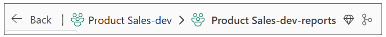

An important consideration when working with the **Branch out to
workspace** command involves the permissions required in the GIT
repository and in Fabric. To branch out to a new workspace, you must
have permissions to create new branches in the GIT repository. You also
need permissions in Fabric to create new workspaces and to assign
workspaces to a Fabric capacity.

> More info on branching workspaces in Fabric
> - [Development process using branched
  workspace](https://learn.microsoft.com/en-us/fabric/cicd/git-integration/branched-workspace)
> - [Required Git permissions for popular actions](https://learn.microsoft.com/en-us/fabric/cicd/git-integration/git-integration-process?tabs=Azure%2Cazure-devops#required-git-permissions-for-popular-actions)
> - [Required Fabric permissions for popular
  actions](https://learn.microsoft.com/en-us/fabric/cicd/git-integration/git-integration-process?tabs=Azure%2Cazure-devops#required-fabric-permissions-for-popular-actions)

Microsoft is currently working to enhance branched workspace
capabilities to address issues that customers face with permissions.
Fabric plans to introduce a new delegated model to enable self-service
branch out operations for users that do not posses the permissions to
create workspaces or assign a workspace to a Fabric capacity.

In addition to the **Branch out to workspace** command, there are
several other commands in the **Source control** pane that used to
manage branched workspaces and their connections to feature branches.
The **Switch branch** command allows you to switch the connection for
the current workspace from one branch to another in the same GIT
repository. Before switching to another branch you must either commit or
discard any uncommitted changes in the workspace. When switching to a
different branch, Fabric runs an **Update from GIT** operation which can
involve adding, updating and/or deleting workspace items in the current
workspace.

The **Check out new branch** command runs a set of operations that can
assist with resolving merge conflicts between a feature branch and the
integration branch. This command allows the user to switch from the
current branch to a new branch without having to discard any changes in
the current branch. This command is used to resolve merge conflict
scenarios.

> More info on branching workspaces in Fabric
> - [Development process using branched workspace](https://learn.microsoft.com/en-us/fabric/cicd/git-integration/branched-workspace)
> - [Required Git permissions for popular actions](https://learn.microsoft.com/en-us/fabric/cicd/git-integration/git-integration-process?tabs=Azure%2Cazure-devops#required-git-permissions-for-popular-actions)
> - [Required Fabric permissions for popular actions](https://learn.microsoft.com/en-us/fabric/cicd/git-integration/git-integration-process?tabs=Azure%2Cazure-devops#required-fabric-permissions-for-popular-actions)

### Client Tools

You have learned that you can build Fabric CI/CD development process in
which developers update items in a branched workspace. However, Fabric
CI/CD also supports an alternative development methodology for
developers that prefer to make their updates directly to the source
files in an item definition files using client tools such as Visual
Studio Code. When using this approach, you start by creating a new
feature branch from integration branch. Once you have created a feature
branch, you can then download a working copy of the files in the feature
branch using the **git clone** command.

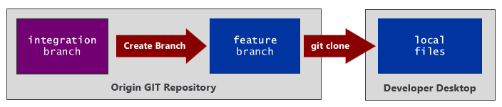

The **git clone** command creates a local folder with a working copy of
the files in the feature branch. You can open this folder and examine
the files inside using a client tool such as Visual Studio Code. This
makes it possible to view the contents of item definition files and
update them directly using the code editor in Visual Studio Code.

Let's look at an example of a development process in which you edit item
definition files for a semantic model using Visual Studio Code. You can
start by creating a feature branch from the integration branch and then
running the **git clone** command to create a local folder with a
working copy of files in the feature branch. At this point, you can use
Visual Studio Code to open the local folder which makes it possible to
view and edit item definition files. The following screenshot shows an
example of updating the contents of **sales.tmdl** to change the format
string for a measure in the **Sales** table.

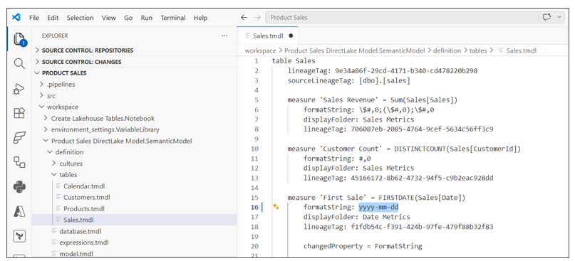

Once you have made changes to one or more item definition files, you
must commit your changes locally. After that you must push your changes
back to the remote feature branch in the origin GIT repository.

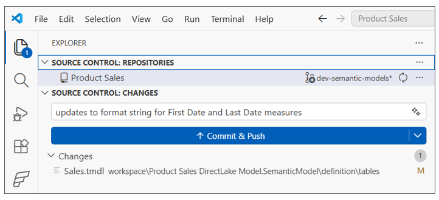

Keep in mind that editing to item definition files for a semantic models
is relatively easy. That's because the item definitions for semantic
models are based on the TMDL format which was created with the explicit
purpose of making TMDL files readable and updatable by humans. Item
definition files for other types of workspace items can be far more
difficult to update by hand.

Directly manipulating item definition files is a powerful technique that
assumes you know what you are doing. For example, updating the JSON
content for pipeline by hand is far more challenging. If you update an
item definition file with invalid syntax, you will experience errors
later in the development lifecycle when trying to propagate your changes
to other workspace items..

It is also possible to build a development process which used Power BI
Desktop as a client tool. This works for reports and for semantic models

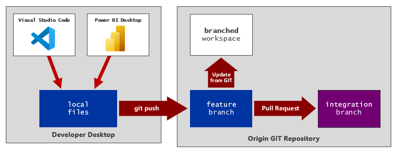

content to come

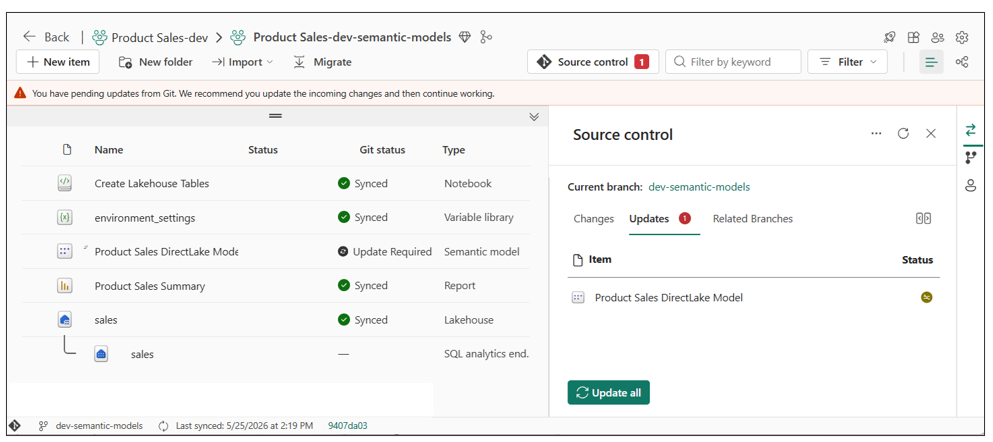

content to come

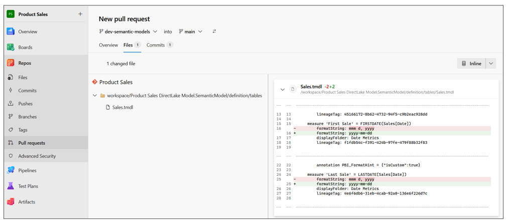

### Variable Libraries

An essential aspect of the CI/CD lifecycle involves promoting changes
through a sequence of environments. The canonical example is a Fabric
solution lifecycle which moves changes through environments such as
**dev**, **test** and **prod**. When you need to test and validate code
for a project across multiple environments, it’s essential to find an
effective parameterization strategy for environment-specific settings.

The Fabric platform provides the **variable library** to assist with
parameterization. The variable library is a creatable type of workspace
item in which you can define a set of variables. Other workspace items
such as notebooks, pipelines, copy jobs and dataflows can be defined to
read variable values from a variable library. This makes it possible to
avoid hardcoding configuration settings that change across environments.

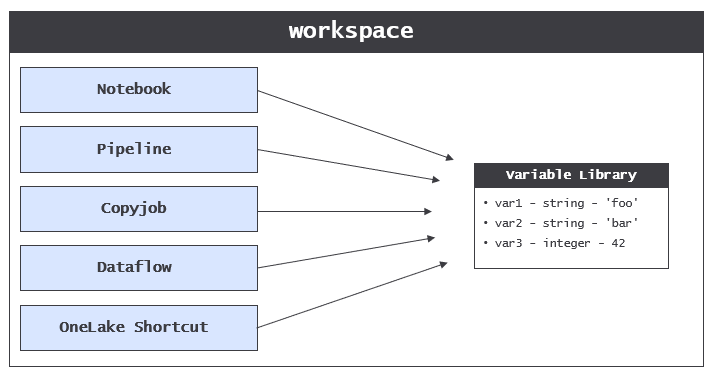

Consider the classic scenario in which you need to build a release
process that moves workspace item updates through a sequence of
workspaces representing environments such as **dev**, **test** and
**prod**. The problem is that items in different workspaces must be
configured with different settings to connect to a different database or
to some other type of datasource. To solve this problem, items in each
workspace requires access to their own unique connection settings.

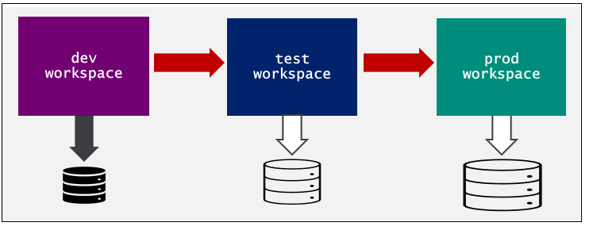

The variable library was designed to solve the problem of parameterizing
these types of settings across workspaces. A variable library allows you
to avoid hardcoding the configuration settings required to connect to a
database. Consider a scenario in which you must write Python code in a
Fabric notebook to connect to a SQL database. The thing you want to
avoid is hardcoding these configuration settings into your code as
literal strings.

``` python
database_server = 'devcamp.database.windows.net'
database_name = 'ProductSalesDev'
```

The obvious problem is that these hardcoded settings are specific to a
single environment. As an alternative, you can leverage a variable
library to enable support for parameterization. You start by creating a
new variable library with a display name such as
**environment_settings**. Next, you can add two string variables named
**database_server** and **database_name**.

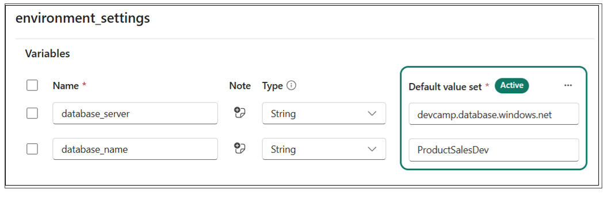

Once you have created the variable library with the two variables, you
can remove the hardcoded configuration values from the notebook and
replace them with code to read the variable values at run time.

``` python
database_server =
notebookutils.variableLibrary.get("\$(/\*\*/environment_settings/database_server)")

database_name =
notebookutils.variableLibrary.get("\$(/\*\*/environment_settings/database_server)")
```

You have learned that a variable library allows you to add variables.
That's probably not too surprising. However, variable libraries have
another important dimension used to provide parameterization support
across workspaces. More specifically, Fabric allows you to extend a
variable library using ***value sets***.

Let's take a step back to build your understanding of why value sets are
important. You've learned that a variable library is a collection of
variables where each variable is defined with a name, a type and a
default value.

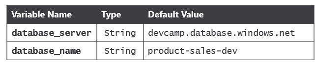

The purpose of a value set is to provide an alternate set of values for
each of the variables in the variable library. Consider an example of a
variable library in which the default values have been configured for
the **dev** environment. You can extend the variable library by adding a
value set for the **test** workspace and a second value set for the
**prod** workspace.

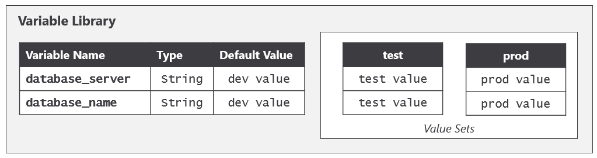

The item definition for a variable library includes variables and values
sets. However the item definition does not contain anything to indicate
which value set is active. That's because Fabric maintains a separate
workspace-level setting that tracks which value set is active in the
context of that workspace. That means three different workspaces could
each contain a variable library with an identical item definition, yet
each workspace can be configured to use a different value set.

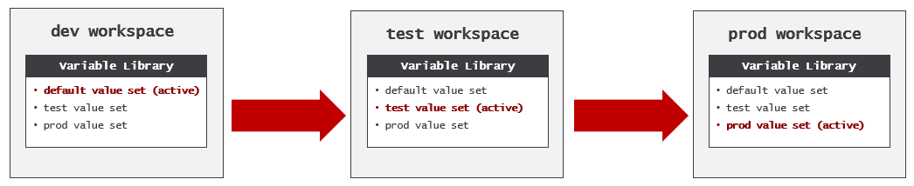

You can create variables in a variable library based on standard types
including **String**, **Number**, **Integer**, **DateTime** and
**Guid**. Variable libraries additionally support two important
reference variable types which are **Connection reference** and **Item
reference**. Using these reference variable types makes it easier to
edit variable values through the Fabric UI. When you edit the value of a
reference type variable, Fabric presents with an item picker showing a
list of candidate items from which to choose.

**Connection reference** variables are commonly used to parameterize
connections for items involved with ETL such as pipelines and shortcuts
in a lakehouse. It's a best practice to design items which connect to
external datasources using a variable library which includes a
connection reference variable and other variables which parameterize
datasource paths. Using a connection reference variable is considered a
best practice because it removes anything from the item definition that
is environment specific.

**Item reference** variables are useful for managing dependencies
between items in the same solution. This is especially true when you
need to deal with an item dependency that spans across workspace
boundaries. Let's revisit the scenario with the multi-workspace solution
introduced earlier. There is a notebook in the staging workspace that
needs to write its output to a lakehouse in the presentation workspace
with gold layer tables. You can use an item reference variable to
parameterize the target lakehouse. This, in turn, provides the ability
to remove any code from the notebook which is environment specific
because the notebook can use the item refence to determine where to
write its output.

### Workspace Item Types

Every Fabric solution is designed as a composition of workspace items
and each item is based on a **workspace item type** which defines its
capabilities and the user experience it provides in the Fabric service.

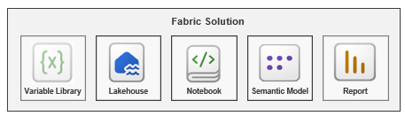

The core abstraction of the workspace item type in Fabric is what allows
artifacts from different Fabric workloads to behave in a similar and
consistent manner. For example, each workspace item type provides the
GIT synchronization capability to generate an item definition for a
workspace item and to store that item definition in GIT. Likewise, each
workspace item type provides the complimentary behavior to respond to
**Update from GIT** operation by either creating or updating an item
using an item definition in GIT.

It is important to understand that Fabric is an evolving platform. The
behavior of workspace item types is updated on a regular basis.
Moreover, Fabric is continually adding new workspace item types to the
platform. As a result, some workspace item types are more mature than
others with respect to their CI/CD capabilities.

There are four primary CI/CD capabilities that are supported by some but
not all workspace item types.
- Support for reading variables from a variable library
- Support with Fabric REST APIs to create and update items using item definitions
- Support for calling Fabric APIs using a service principal identity
- Support for auto-binding workspace item dependencies

Whenever possible, you should use variable libraries to manage
parameterization across environments. However, not all workspace item
types support variable libraries. So, what should you do when you are
building a Fabric solution and you encounter a workspace item type that
does not support variable libraries? To achieve the same goal with
respect to parameterization, you might be required to make direct edits
to an item definition either in GIT or through a Fabric REST API call.

There can also be differences between workspace items types in their
support for the Fabric REST APIs. While some workspace item types
support creating and updating workspace items using item definitions,
others do not. You also might encounter workspace item types do not
support calling the Fabric REST APIs as a service principal. This is
especially true as workspace item types are initially released in public
preview.

### Auto-binding Support

The majority of Fabric workspace item types are able to self-manage
their relations to other items in the same workspace. More specifically,
some workspace item types can auto-bind to the other items on which they
depend. This auto-binding behavior occurs as part of the GIT
synchronization process. Workspace item types that do not support
auto-bind behavior require your attention because you might be required
to run a script after an **Update from GIT** operation completes to
correctly rebind item dependencies.

Take an example of a Fabric solution composed of a lakehouse, a notebook
and a pipeline. Assume that the notebook has a dependency on the
lakehouse and that the pipeline has a dependency on both the lakehouse
and the notebook. After you have built out the solution in the **dev**
workspace, there are three established dependencies between these
workspace items.

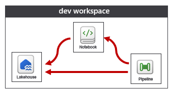

Now think about what happens when you use Fabric GIT synchronization to
replicate these three workspace items from the **dev** workspace to a
feature workspace. The outcome you want to avoid is for workspace items
created in the feature workspace to retain their dependencies pointing
back to an item in the **dev** workspace. Instead, the desired outcome
is for each workspace item to properly resolve its dependencies to its
related items in the same workspace. You can see from the following
diagram that the notebook and pipeline in the feature workspace were
both able to self-manage their relations.

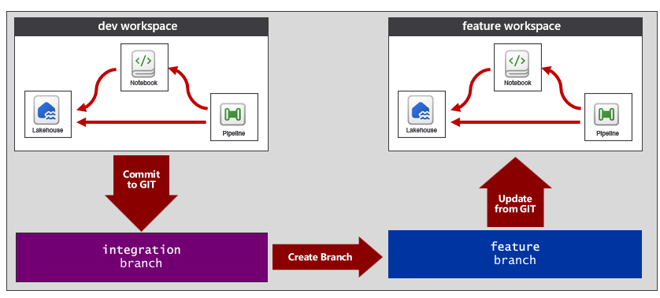

Fabric notebooks did not support auto-binding until Microsoft updated
the **Notebook** item type with auto-binding support in March of 2026.
It is also noteworthy that notebooks do not support auto-binding by
default. Instead, you must extend a notebook's item definition with a
**notebook-settings.json file** as discussed the following section on
item definitions.

Also, keep in mind that not all workspace item types support
auto-binding. If you're building a Fabric solution with an item type
that lacks support for auto-binding, you might be required to write a
script for a post-sync job to reestablish relations.

### Item Definitions

Item definitions represent an essential component type in the Fabric
platform's support for CI/CD. At its core, an item definition is a named
folder containing a set of files which contain settings and metadata to
represent an item of a specific workspace item type. While the files in
an item definition vary significantly from one workspace item type of
another, the idea that every type of workspace item can be serialized
into a folder in GIT provides the foundation of the Fabric CI/CD
infrastructure.

Every item definition requires a file named **.platform** which is known
as the **platform file**. The platform file contains metadata such as
the item type and display name. The platform file also contains a
**logicalId** value which is used by Fabric internally to track logical
instances of workspace items as they are propagated across GIT branches
and workspaces.

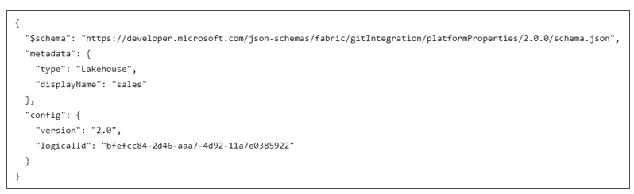

In addition to the platform file, each workspace item type defines its
own unique schema for the files required and/or allowed in an item
definition. As an example, the item definition for a lakehouse contains
files such as **alm.settings.json**, **lakehouse.metadata.json** and
**shortcuts.metadata.json**.

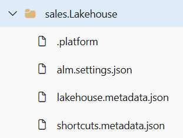

The minimal item definition for a notebook just requires one file named
**notebook-contents.py** in addition to the platform file.

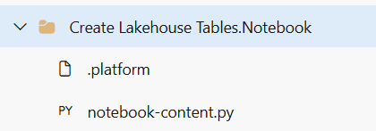

Remember that notebooks do not support auto-binding behavior by default.
However, you can extend the item definition for a notebook to support
auto-binding by adding a **notebook-settings.json** file with content as
shown in the following screenshot.

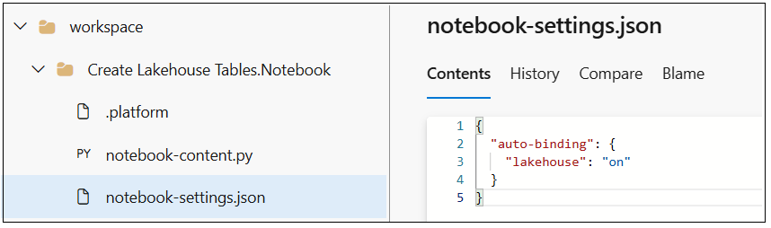

> Note that Fabric supports working with item definitions for notebooks
using either the **.py** format or the **.ipynb** format.

While some item definitions contain a small number of files, that is not
always the case. As an example, the item definition for a semantic model
can include dozens or even hundreds of TMDL files which are structured
across several folders

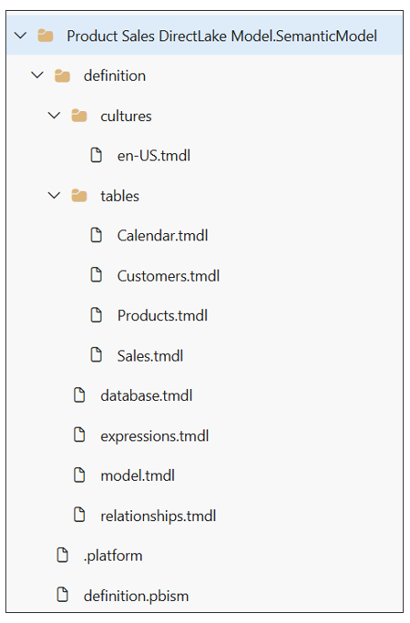

While an item definition with a large number of files adds complexity,
it also allow for collaboration in a much more granular fashion.
Consider the benefit of splitting out each table into its own file in
the item definition for a semantic model. This file structure allows one
developer to work on the measures in the **Sales** table while another
developer is making changes to the **Calendar** table. This extra
granularity is essential when multiple developers are working on a large
semantic model at the same time.

In this section, you have seen examples of item definitions for
lakehouses, notebooks and semantic models. However, you will be working
with workspace item types beyond these three. In general, you should
gain a basic understanding of item definition files for each of the
workspace item types you work with in a Fabric CI/CD project. An easy
way to get started is to walk through item definition files in GIT which
have been created using GIT synchronization.

> Fabric Item Definitions
> - [Item management overview](https://learn.microsoft.com/en-us/rest/api/fabric/articles/item-management/item-management-overview)
> - [Item definition overview](https://learn.microsoft.com/en-us/rest/api/fabric/articles/item-management/definitions/item-definition-overview)
> - [GIT Repository with public item definition schemas](https://github.com/microsoft/json-schemas/tree/main/fabric/item)

### The Role of the logicalId

Using Fabric GIT integration, you are able to replicate a set of
workspace items from one workspace to another. As an example, imagine
you have created a lakehouse named **sales** and you have used GIT
synchronization to replicated the lakehouse across three different
workspaces. All three lakehouse instances share the same type and
display name. However, each lakehouse instance is assigned a unique
i**d**.

In order to support auto-binding behavior, Fabric needs a way to track
that these three lakehouse instances are all associated a single logical
item. This is where the **logicalId** comes in. While each lakehouse
instance has it own unique **id**, all three lakehouses share the same
**logicalid**.

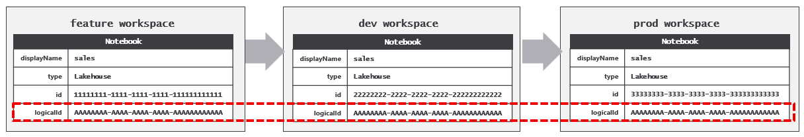

The role of the **logicalId** is important because it allows Fabric to
avoid persisting workspace-specific item ids into GIT. This level of
indirection is what makes it possible for Fabric to support
auto-binding. As an example, examine the following code snippet from the
item definition for a pipeline that has a dependency on a lakehouse in
the same workspace.

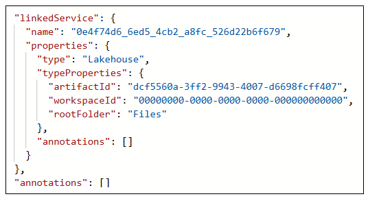

You should notice that the **workspaceId** does not have value that
references an actual workspace id. Instead, the **workspaceId** has an
empty GUID value of **00000000-0000-0000-0000-000000000000** which
indicates that the **artifactId** has a value that references the
**logicalId** of the lakehouse instead of a workspace-specific item id.
When you run an **Update from GIT** operation which creates the
lakehouse and pipeline in a new workspace, Fabric is able to use the
**logicalId** to lookup the workspace-specific lakehouse id which is
then used to bind the pipeline to the lakehouse in order to reestablish
the relation.

It's unlikely that you will ever need to work directly with the
**logicalId**. In general, you can think of the **logicalId** as an
internal property used by Fabric behind the scenes. Furthermore, You
should never modify a **logicalId** value as this is an unsupported
action that can lead to unpredictable behavior.

### Deployment Pipelines

The Fabric platform provides Deployment Pipelines as a continuous
deployment mechanism to help manage the lifecycle of workspace items.
The key concept behind Deployment Pipelines is that changes to workspace
items can be deployed through a set of stages where each stage is
assigned to a Fabric workspace associated with an environment. The
following screenshot shows the user interface of a Deployment Pipeline
which makes it possible to deploy item-level changes across workspaces.

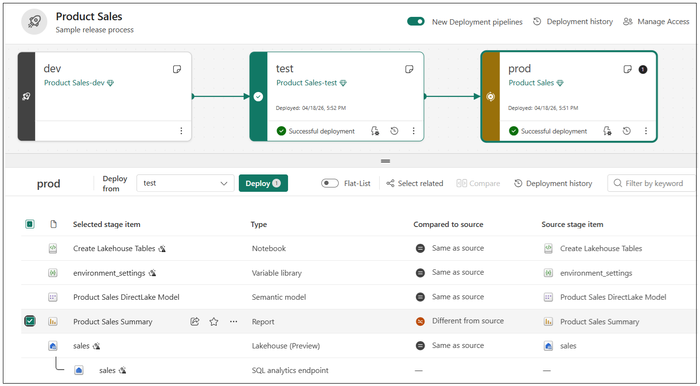

Deployment Pipelines are designed to enhance productivity by hiding
low-level details associated with propagating changes through a sequence
of workspaces. Deployment Pipelines are similar to GIT synchronization
in that they automatically rebind item relationships when deploying a
Fabric solution with item dependencies between lakehouses, notebooks and
pipelines.

Deployment Pipelines were originally introduced in the Power BI service
several years before Microsoft first released Fabric. In their initial
release, deployment pipelines offered **deployment rules** as a
mechanism used to support parameterization. For example, you can
configure a semantic model with a deployment rule to update its
datasource location so the semantic model in each of the three
workspaces connects to its own environment-specific database.

Deployment Pipelines in Fabric continue to support deployment rules.
However, deployment rules should not be your first choice when it comes
to parameterization. Instead, you should prefer using variable libraries
to solve parameterization problems. The key point is that variable
libraries are strategic in the Fabric roadmap while deployment rules are
not.

As of June 2026, semantic models do not yet support variable libraries.
Therefore, configuring datasource location in a Deployment Pipeline
using deployment rules is your best option until Microsoft releases
variable library support with semantic models which is expected in the
second half of 2026.

Deployment Pipelines are designed to assist with continuous deployment
in building a release process. Keep in mind that the release process
only covers the second half of full CI/CD lifecycle. The use of
Deployment Pipelines should be combined together with Fabric GIT
integration to fully implement a complete end-to-end solution. This
topic will be revisited in the upcoming section on building a release
pipeline.

## Automation in Fabric CI/CD

Rolling out a Fabric project with end-to-end CI/CD support requires a
significant number of steps. Your ability to automate the setup process
is essential. The alternative approach, known as ClickOps, involves
completing setup tasks by hand using a browser. Relying on ClickOps is
bad because it’s prone to human error causing unnecessary delays and the
need to troubleshoot configuration errors. This is especially true when
considering how to create a fast and reliable plan for disaster
recovery.

The Fabric platform provides public APIs which make it possible to
automate setup and CI/CD processes for a Fabric project. The primary API
used to create workspace, connections and workspace items is the Fabric
REST APIs. While you can write code that calls the Fabric REST APIs
directly, you also have the option to boost your productivity by
leveraging developer tools and libraries which call the Fabric REST API
on your behalf as shown in following diagram.

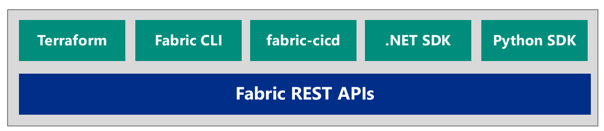

This section will begin by examining the most common scenarios which
require you to write automation logic. For example, you will learn what
needs to be automated during the project setup phase. You will also
learn why and when you need to develop workflows which must be
integrated into the development process as well as the release process.

Once you understand what needs to be automated, you will next learn your
options for writing and versioning automation logic. You will learn
about essential developer tools including Terraform and the Fabric CLI.
The section will also introduce the **fabric-cicd** library and explain
why it has been adopted as a best practice for building the release
process for Fabric solutions. The sections concludes with a primer on
Fabric REST APIs programming for developers that need the greatest level
of control with Fabric automation.

### Determining What Needs To Be Automated

The first part of your journey to roll out a Fabric CI/CD project is
setting up the project's infrastructure. The infrastructure for a Fabric
CI/CD project includes tenant-scoped items in Fabric such as workspaces,
capacities, connections, gateways and deployment pipelines. You'll also
need to create a GIT repository and configure GIT integration support
between Fabric workspaces and GIT branches.

After a Fabric CI/CD project is up and running, there is often an
ongoing need to create and configure feature workspaces. Consider the
flow for creating a new feature workspace which involves creating a new
feature branch from the integration branch and then running an **Update
from GIT** operation against a new workspace.

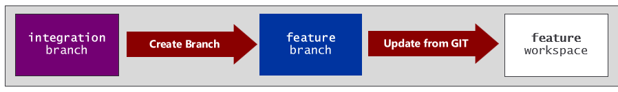

The problem is that the **Update from GIT** operation doesn't go far
enough. For example, the **Update from GIT** operation will create a
lakehouse, but it will not automatically populate the lakehouse with
tables. The **Update from GIT** operation will create a semantic model,
but it will not automatically create and bind a connection to the
semantic model's datasource.

The key observation is additional automation is often required after a
workspace has been initialized or updated with an **Update from GIT**
operation. This provides a motivation for writing custom scripts to
complete whatever tasks are required to prepare a feature workspace for
development. As you begin developing these types of scripts, you should
consider two different types of jobs.

- **Post-deploy jobs** run only once after an empty workspace is first
  initialized with an **Update from GIT** operation.
- **Post-sync jobs** run each time after an **Update from GIT**
  operation completes on a workspace.

You can think of a **post-deploy job** as a set of one-time tasks that
are part of the workspace initialization process. An example of common
tasks automated in a post-deploy job are setting the active value set
for a variable library and running a notebook to populate a lakehouse
with data. Another common task is creating and binding a connection for
each semantic model. If your Fabric solution includes a semantic model
built using import, you should also automate the process of running a
refresh operation to ingest and store the imported data.

You should avoid adding ETL logic directly into the scripts that you
write for post-deploy jobs. Instead, it's recommended that you factor
out ETL logic and add it into workspace items designed for ETL purposes
such as notebooks, pipelines, copy jobs, user-defined functions and
dataflows. If you write the logic in a post-deploy script to discover a
notebook by name and then run it, you can then update the ETL logic in
the notebook without requiring any updates to the script. This is an
important topic that will be visited in the section on data
orchestration.

A **post-sync job** contains logic that must run every time after an
**Update from GIT** operation completes. As an example, consider the
scenario where a developers makes a series of changes to items in a
feature workspace which are committed to GIT in the feature branch.
After that, a pull request is created and approved to merge the changes
into the integration branch.

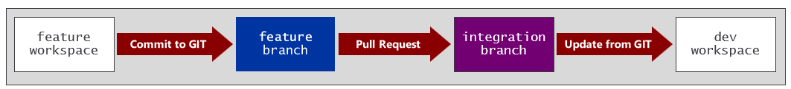

How do you synchronize the **dev** workspace with changes merged into
the integration branch? You can start by developing a workflow that is
triggered whenever changes are merged into the integration branch. This
workflow should start by running an **Update from GIT** operation to
sync changes from the integration branch to the **dev** workspace.
However, some workspace items might require additional modification
after the **Update from GIT** operation completes. This can be the case
when you are working with workspace items that do not support auto-bind
behavior. It can also be the case when you re working with items which
do not yet support variable libraries yet require environment-specific
settings.

There are several different ways to author automation logic. Regardless
of Whether you use a tool or you call Microsoft APIs directly, you must
consider the identity used to run your automation jobs. Every call to
Fabric REST APIs executes under the identity of a specific Entra Id
security principal. Fabric REST APIs support two types of identity which
are **user principals** and **service principals**. It is a best
practice to execute API calls as a service principal. This is especially
true when code with workflow automation logic for CI/CD processes
executes in a cloud-based platform such as Azure pipelines or GitHub
Actions workflows.

### Creating Project Infrastructure using Terraform

Terraform is an open-source tool built on the principles of
**infrastructure as code (IaC)**. IaC is based on the pattern of
defining the infrastructure for a software project using configuration
files as opposed to using manual processes or procedural programming
logic. For many organizations managing cloud based deployments, the use
of IaC has become a well-established best practice in DevOps and CI/CD.

Terraform offers the advantage of building a deployment process that is
both versionable and repeatable. For example, you can version a
Terraform configuration simply by adding its configuration files to a
GIT repository just as you would version any of type of source files. A
Terraform deployment process is also repeatable. That means you can run
it again and again and it will produce the same outcome. A repeatable
process provides consistency and the fastest path to disaster recovery.

From an architectural perspective, Terraform plays the role of an
orchestrator which completes its work by calling APIs behind the scenes.
But Terraform doesn't call these APIs directly. Instead, it delegates
this work to **Terraform providers** which are plugin components
designed to interact with a specific set of cloud-based APIs. One reason
that Terraform has become so popular is due to its registry which
contains 1000s of available providers allowing you to manage resources
in platforms such as Azure, AWS, and Google cloud. Microsoft released
the **Fabric provider for Terraform** in 2025 making it possible to set
up the infrastructure for a Fabric CI/CD project using an IaC-based
provisioning process.

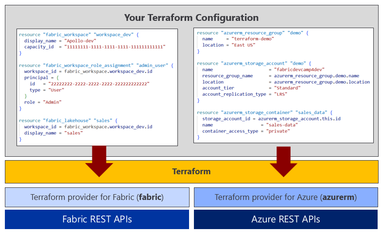

A Terraform configuration is defined using a set if files containing
HashiCorp Configuration Language (HCL). Let's walk through a simple
example of a Terraform configuration which uses a standard project file
structure. The following screenshot shows simple Terraform configuration
with five files. The **variables.tf** file is used to define a set of
typed variables. The **terraform.tfvars** file is used to assign
variable values in a scenario in which Terraform is running locally in a
client tool such as Visual Studio Code.

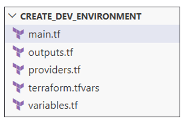

Note that the **terraform.tfvars** file often contains sensitive
information such as a client secret to authenticate as a service
principal. For this reason, it's common to add a **.gitignore** file so
the **terraform.tfvars** is never uploaded into a GIT repository.

HCL is a superset of JSON which uses syntax based on blocks which
contain arguments. The **providers.tf** file contains a **terraform**
block with two arguments named **required_version** and
**required_providers**. The **required_version** argument specifies the
minimum version of Terraform and the **required_providers** argument
contains a block for each provider with the source and version. This
examples demonstrates loading the Fabric provider for Terraform. The
**providers.tf** file also contains a **provider** block for the Fabric
provider which authenticate as a service principal by using variable
values to set the arguments **tenant_id**, **client_id** and
**client_secret**.

``` hcl
terraform {
  required_version = "\>= 1.8, \< 2.0"
  required_providers {
    fabric = {
      source = "microsoft/fabric"
      version = "1.8.0"
    }
  }
}

# configure Fabric Provider to authenticate as SPN
provider "fabric" {
  tenant_id = var.tenant_id
  client_id = var.client_id
  client_secret = var.client_secret
}
```

Once a Terraform configuration contains what's required to initialize
the provider, the next step is to run the **terraform init** command.
Running **terraform init** downloads the executable code for the
provider along with extra security configuration used to verify nobody
has tampered with the downloaded provider code.

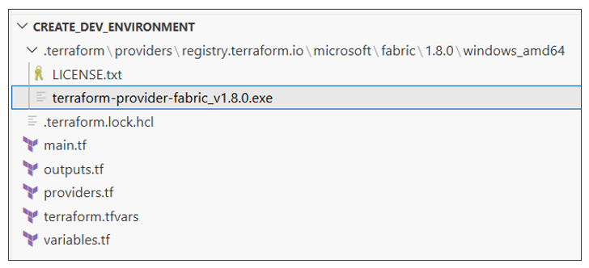

After initialing the Fabric provider, the next step is create resources
by adding **resource** blocks to **main.tf**. Each **resource** block
requires a provider-specific resource type and a local resource name.
The Fabric provider offers the **fabric_workspace** resource type for
creating workspaces and the **fabric_workspace_role_assignment**
resource type for configuring access by adding workspace role
assignments.

``` hcl
resource "fabric_workspace" "workspace_main" {
  display_name = var.workspace_name
  capacity_id = var.capacity_id
}

resource "fabric_workspace_role_assignment" "admin_group" {
  workspace_id = fabric_workspace.workspace_main.id
  principal = {
    id   = var.admin_group
    type = "Group"
  }
  role = "Admin"
}

resource "fabric_workspace_role_assignment" "dev_group" {
  workspace_id = fabric_workspace.workspace_main.id
  principal = {
    id   = var.dev_group
    type = "Group"
  }
  role = "Member"
}
```

When creating a **fabric_workspace** resource, you need to specify
argument values for **display_name** and **capacity_id**. You should
also take note that the **fabric_workspace** resource is assigned a
local name of **workspace_main**. The local name is important because it
makes it possible to create references using the syntax
**fabric_workspace.workspace_main.id**.

Once you have created a Terraform configuration with a set of resources,
you can run the **terraform** **plan** command to review a planned lists
of the steps required to deploy the configuration. However, running the
**plan** command doesn’t actually do anything. It just shows you the
list of steps that need to be completed. When you're ready to deploy,
you run the Terraform **apply** command to run the job that creates the
resources needed to match your configuration.

When you first run the **apply** command to deploy a configuration,
Terraform creates a state file named **terraform.tfstate** to track the
property values for each resource as it's created or updated. The
following screenshot shows an example of the state tracked for a
**fabric_workspace** resource which include property values for **id**,
**display_name, capacity_id** and **capacity_region**. There is even
state used to track the OneLake endpoints that Fabric creates for a
workspace.

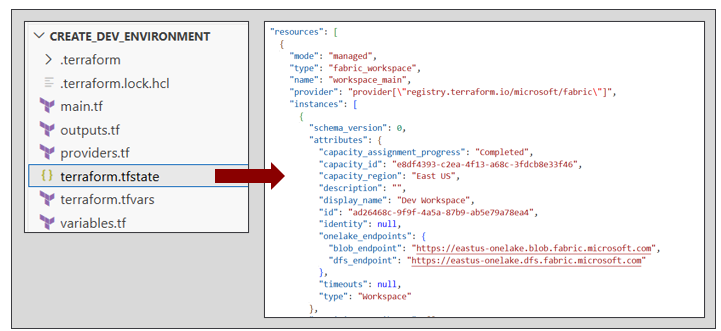

> By default, Terraform creates the **terraform.tfstate** file locally in
the root folder of the current configuration. Running Terraform with a
local state file keeps things simple when you're first learning to use
Terraform and when you are developing and testing configurations. In
production, things are quite different. That's because it is critical to
initialize a configuration to manage the state file in cloud storage
such as an Azure storage account. Also keep in mind that the state file
often contains sensitive data such as authentication credentials.
Therefore, it is a best practice to limit access to the state file and
to encrypt its contents.

This sample configuration also contain an **output.tf** file with
**output** blocks created to capture property values for resources that
have been created by the configuration. Here is an example of two
**output** blocks used to provide values for the workspace id and DFS
endpoint.

``` hcl
output "workspace_id" {
  description = "Id of Fabric workspace"
  value = fabric_workspace.workspace_main.id
}

output "workspace_dfs_endpoint" {
  description = "DFS endpoint for Fabric workspace"
  value = fabric_workspace.workspace_main.onelake_endpoints.dfs_endpoint
}
```

When you run the **terraform apply** command, output values are written
to the console after all provisioning has completed.

``` hcl
workspace_dfs_endpoint = "https://eastus-onelake.dfs.fabric.microsoft.com"
workspace_id = "ad26468c-9f9f-4a5a-87b9-ab5e79a78ea4"
```

Let's take a step back and discuss the importance of the Terraform state
file. By tracking the state of resources in the current deployment,
Terraform has the ability to compare what's in the configuration against
what's been deployed. This allows Terraform to determine what resources
need to be created, updated or destroyed each time you run the **apply**
command.

The first time you run the **terraform apply** command, Terraform
creates all the resources defined in the current configuration. If you
then run the **terraform apply** command a second time, nothing happens.
That because Terraform is able to determine that the state file matches
the current deployment.

While Terraform provides a quick and reliable way to provision resources
during project setup, it also plays a valuable role in managing
resources over the lifetime of a project. Imagine a scenario in which
you need to update a resource after the initial deployment. For example,
you decide you need to change the workspace role assignment resource
with the local name of **dev_group** from a role of **Member** to a role
of **Contributor**. You just need to update the resource argument in
your configuration, save your changes and then run the **apply**
command.

With Terraform, you just need to define the configuration you want. You
don't have to worry about the steps or the sequence of API calls
required to get there.

Now that you have seen what's required to create a workspace, let's
examine a configuration used to create a Fabric capacity. The first
thing to understand is that a Fabric capacity is a Azure resource that
must be created with Terraform provider for Azure. You can authenticate
as a service principal using a similar approach used with the Fabric
provider. However, you will also need to include the **subscription_id**
for an Azure subscription which will be used to provision the Fabric
capacity. Keep in mind you must use a service principal that has that
has the appropriate permissions with that subscription to create a
Fabric capacity.

``` hcl
terraform {
  required_version = "\>= 1.8, \< 2.0"
  required_providers {
    azurerm = {
      source = "hashicorp/azurerm"
      version = "4.63.0"
    }
  }
}

provider "azurerm" {
  features {}
  tenant_id = var.tenant_id
  client_id = var.client_id
  client_secret = var.client_secret
  subscription_id = var.subscription_id
}
```

The following listing demonstrates how to create a Fabric capacity.
First, you create an Azure resource group using an
**azurerm_resource_group** resource. Next, you can create a capacity in
that resource group using a **azurerm_fabric_capacity** resource.

``` hcl
data "azurerm_client_config" "current" {}

locals {
  spn_object_id = data.azurerm_client_config.current.object_id
}

resource "azurerm_resource_group" "main" {
  name     = var.resource_group_name
  location = var.capacity_location
}

resource "azurerm_fabric_capacity" "main" {
  name                = var.capacity_name
  resource_group_name = azurerm_resource_group.main.name
  location            = azurerm_resource_group.main.location
  administration_members = [
    local.spn_object_id,
    var.admin_user_upn 
  ]
  sku {
    name = var.capacity_sku_size
    tier = "Fabric"
  }
}
```

In addition to **resource** blocks used to create resources, Terraform
also supports adding **data** blocks for scenarios in which you just
need to query a datasource for data. The previous listing demonstrates
using a **data** block based on a **azurerm_client_config** datasource.
This datasources makes it possible to dynamically retrieve information
about the service principal used to run the Terraform deployment
process. The listing also demonstrates adding a **locals** block with a
local variable named **spn_object_id** with the service principal object
id which is used in the **azurerm_fabric_capacity** resource to add the
service principal to Fabric capacity's administrators group.

When you configure a **azurerm_fabric_capacity** resource, you must
configure a **sku** block with a **name** argument to configure the SKU
size. For example, you can provision the capacities for your project
environments with an **F4** for **dev**, an **F16** for test and **F64**
for prod. Now think about the scenario a few months later when you
determine the **test** environment capacity isn't as powerful as it
needs to be and you need to bump it up to a larger SKU size such as
**F32**. Terraform makes things easy. You just need to update the
**test** environment configuration with the new SKU name value of
**F32** and run the **apply** command.

Now consider a scenario in which you need to create a Fabric capacity
and a workspace in the same configuration. That means you need to load
both the Azure provider and the Fabric provider. There is one aspect to
this that is tricky. The Azure provider and the Fabric provider use
different formats for the capacity id. Fabric uses a GUID-based id for
capacities while Azure uses a long string identifier containing the
subscription id and resource group name. The best way to deal with this
is to add a **fabric_capacity** datasource to query the capacity for its
GUID-based id. The following listing demonstrates using the **id** of a
**fabric_capacity** datasource to assign the **capacity_id** property of
a **fabric_workspace** resource.

data "fabric_capacity" "main" {

display_name = var.capacity_name

depends_on = \[ azurerm_fabric_capacity.main \]

}

resource "fabric_workspace" "main" {

display_name = var.workspace_name

capacity_id = data.fabric_capacity.main.id

depends_on = \[ data.fabric_capacity.main \]

}

A Terraform configuration for building Fabric environments typically
includes workspace and capacities. However, you can also provision other
types of Azure resources such as an Azure storge account, an Azure SQL
database or an Azure Key vault. The following diagram shows an example
of a Fabric CI/CD project plan which includes a standard set of
resources required by three environments. Each environment contains the
same set of resource types yet parameterization can give each
environment its own unique resource settings.

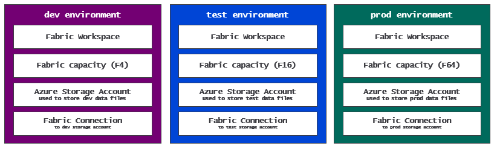

When using Terraform, it's recommended that you create a separate
configuration for each environment. After all, you don't want a problem
in the configuration for the **dev** environment or the **test**
environment to affect the **prod** environment. You can create
configurations for these environments using a provisioning flow to
create resources in the following sequence.

- **azurerm_fabric_capacity**: create Fabric capacity

- **fabric_workspace**: create workspace assigned to capacity

- **fabric_workspace_role_assignment**: add workspace role assignments
  for access control

- **azurerm_storage_account**: create Azure storage account

- **azurerm_storage_container**: create container in Azure storage
  account for environment-specific data files

- **azurerm_storage_account_blob_container_sas**: create SAS token as
  credential to access storage container

- **fabric_connection**: create Fabric connection used to access data
  files in storage account

- **fabric_connection_role_assignment**: add connection role assignment
  to configure connection permissions

This example demonstrates how Terraform simplifies the setup process for
building out the environments for a Fabric CI/CD project. This example
also shows how Terraform helps to manage security and governance. For
example, the Terraform configuration automatically handles configuring
permissions and access to resources. If anything changes in the future
with respect to permissions or access control, you can simply update the
configuration and then run the **terraform apply** command.

There is a second aspect to this example which demonstrates another
security-related best practice. The configuration creates a credential
in the form of a SAS token and then uses that credential to create a
Fabric connection. This is a best practice because it eliminates any
need to share credentials with other humans or external processes. The
Terraform configuration manages credentials behind the scenes in a state
file that is locked down and encrypted in cloud storage. Terraform
creates the connection, configures its permissions and pass the
connection id back to you as output.

Resources for Terraform

- [Terraform
  Documentation](https://developer.hashicorp.com/terraform/docs)

- [Terraform on Azure
  documentation](https://learn.microsoft.com/en-us/azure/developer/terraform/)

- [Microsoft Fabric
  Provider](https://registry.terraform.io/providers/microsoft/fabric/latest/docs)

### Fabric CLI

Fabric CLI is a developer tool that offers the easiest path to writing
automation logic to complete tasks in Fabric for DevOps and CI/CD. At a
high level, Fabric CLI acts as a façade which abstract away the
underlying Microsoft APIs to provide a single, focused experience to
assist with Fabric automation. Fabric CLI adds value by shielding you
from having to worry about Entra Id authentication, access token
acquisition and the execution of HTTP requests. Fabric CLI also
simplifies running automation logic under the identity of a service
principal.

Fabric CLI is a is a command-line interface tool that supports both an
interactive mode and a scripting mode. The interactive mode makes it
quick and easy to type and execute a sequence of commands. For example,
you can use Fabric CLI in interactive mode to create a new workspace and
then to create a lakehouse inside that workspace. Fabric CLI also
provides commands to load data into lakehouse tables and to automate
running notebooks and pipelines which contain ETL logic.

Fabric CLI scripting mode makes it possible to write and version
automation logic for a Fabric CI/CD project. For example, you can use a
shell script or a programming language such as PowerShell or Python to
execute a sequence of Fabric CLI commands. If you decide not to use
Terraform, you can write scripts which call Fabric CLI commands to
create and manage tenant-level items such as workspaces, capacities,
connections, domains and gateways.

Fabric CLI offers rich support for creating and managing workspace
items. For example, Fabric CLI provides commands such as **create**,
**get**, **set** and **rm** to perform CRUD operations on workspace
items. There are also two Fabric CLI commands that allow you to work
with an item definition. Fabric CLI provides an **import** command used
to create or update a workspace item using an item definition. There is
also a complimentary **export** command used to export a workspace item
to an item definition as a set of definition files in a local folder.

Another important capability of Fabric CLI is its ability to integrate
with cloud-based GIT providers such as Azure DevOps and GitHub. If
you're developing workflows using GitHub workflow actions, it's
relatively straight forward to install and load Fabric CLI executable
which enables you develop workflows using Fabric CLI commands. If you're
developing workflows using Azure pipelines, you can use the **Microsoft
Fabric Extension for Azure DevOps** which adds the FabricCLITask@0 task
which automatically provisions the Fabric CLI into the pipeline agent
without requiring manual installation.

Links for more information about Fabric CLI

- [Fabric CLI](https://microsoft.github.io/fabric-cli/)

- [CLI Modes](https://microsoft.github.io/fabric-cli/essentials/modes/)

- [Fabric CLI
  Commands](https://microsoft.github.io/fabric-cli/commands/)

- [Fabric CLI Usage
  Examples](https://microsoft.github.io/fabric-cli/examples/)

- [Microsoft Fabric Extension for Azure
  DevOps](https://marketplace.visualstudio.com/items?itemName=ms-fabric-api.fabric-automation-tools)

### Semantic Link Labs

Semantic Link is a capability in Microsoft Fabric that bridges the gap
between data science and data analytics by connecting Power BI semantic
models with Python and Spark environments. Semantic Link allows data
scientists to load the data from a semantic model into a
**FabricDataFrame** object which can be used directly with many popular
data science libraries such as pandas and scikit-learn.

**Semantic Link Labs** is a Python library designed for use in Fabric
notebooks which provides access to Semantic Link for developers working
in Fabric. However, Semantic Link Labs goes far beyond just wrapping
Semantic Link. It adds a significant amount of functionality for working
with workspace item such as semantic models, reports, lakehouses,
notebooks and variable libraries. The goal is the Semantic Link Labs
library is to simplify technical processes, empowering developers to
focus on higher-level activities.

Beyond the scenes, Semantic Link Labs completes its work by calling to
public Microsoft APIs such as the Fabric REST APIs, Power BI REST APIs
and the Tabular Object Model. Developers using Semantic Link Labs
benefits from the simplicity of a single API surface without having to
think about the details of acquiring access tokens and dispatching calls
to multiple APIs.. It extends the capabilities of Semantic Link,
offering additional functionality to seamlessly integrate and work
alongside it.

Semantic Link Labs provides the ability to work with workspace items
from the Data Engineering workload such as lakehouses, notebooks and
environments. Semantic Link Labs simplifies creating lakehouses and
notebooks and configuring a notebook to use a specific lakehouse as its
default lakehouse. There is also support for running jobs for notebooks
and pipelines and monitoring job execution to determine whether the job
completed successfully.

If you plan on using the Semantic Link Labs library. You must keep in
mind that it only works inside the Fabric environment. You cannot load
the Semantic Link Labs library in a non-Fabric environment such as Azure
pipelines or GitHub Actions workflows. In order to leverage Semantic
Links Labs from a non-Azure environment, you must maintain code which
uses Semantic Link Labs in a Fabric notebook and then automate running
the notebook.

Semantic Link Lab Resources

- [Semantic Link Labs Code
  Examples](https://github.com/microsoft/semantic-link-labs/wiki/Code-Examples)

- [Semantic Link Labs
  FAQ](https://github.com/microsoft/semantic-link-labs/wiki/Frequently-Asked-Questions-(FAQ))

### Building a release process

Earlier you learned the fundamentals of building a development process
using feature branches and feature workspaces. The goal of the
development process is to create a single source of truth in the
integration branch that is always ready for deployment. Now it's time to
turn your attention to what comes next. You must build a release process
to complete the full CI/CD lifecycle. The question now becomes how to
deploy a Fabric solution to workspaces in environments for testing and
production.

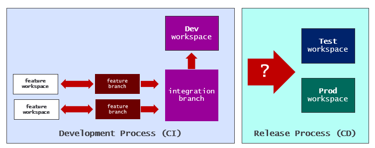

The first and easiest option for building a release process is using a
Deployment Pipeline. Deployment Pipelines offer a low-code approach that
can be a good fit for small to medium-sized projects, especially those
exclusively focused on semantic models and Power BI reports.

As mentioned earlier, Deployment Pipelines assist with building a
release process and not a development process. When you choose to use a
deployment pipeline in a Fabric CI/CD project, you still need to plan
how to build a development process. At a minimum, you should connect the
first workspace in a deployment pipeline to a GIT branch just to gain
the basic CI/CD capability such as versioning items and reverting to an
earlier versions of an item if something goes wrong with an update.

The following diagram shows a deployment pipeline with the first
workspace connected to the **main** branch in a GIT repository. In the
simplest development scenario you can make direct updates to items in
the **dev** workspace and then use **Commit to GIT** operations to
commit changes to GIT where they can be used to revert to earlier item
versions when necessary.

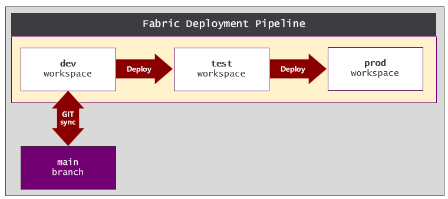

If you decide to build the release process using a Deployment Pipeline,
you still have the ability to design a scalable development process
using feature branches and feature workspaces. As an example, you can
use the **main** branch as the integration branch for your development
process. This makes it possible to create new feature workspaces by
using the **Branch out to workspace** command to branch out from the
**dev** workspace. As changes are committed and merged to the **main**
branch using a pull request, the changes can be synchronized to items in
the **dev** workspace using an **Update from GIT** operation. Once
item-level changes have propagated to the **dev** workspace, they can be
deployed across the other workspaces in the Deployment Pipeline using
the **Deploy** command.

While Deployment Pipelines provides the easiest path to build a release
process, they also have noteworthy limitations which limits their use in
certain scenarios. For example, a Deployment Pipeline and all of its
associated workspaces must exist inside the same Entra Id tenant. If you
have a requirement create the **dev** workspace in one Entra Id tenant
and the **prod** workspace in another, you cannot use deployment
pipelines to build your release process.

There are some other factors to consider as well when deciding whether
to use deployment pipelines. Setting up a Deployment Pipeline always
requires some degree of manual configuration because certain setup tasks
are not supported through public APIs. Deployment Pipeline are also
limited when it comes to setting up manual approval processes. This is
especially true when compared to what's possible with pull requests and
approval gates in a GIT repository. Moreover, deployment pipelines are
not well suited to handle larger projects where there are workspaces
containing 100s of items.

A second option for building a release process using GIT
synchronization. For example, you can use a GitFlow branching strategy
in which a GIT repository is configured with three long-lived branches
named **dev**, **test** and **main**. The **dev** branch serves as the
integration with code ready for deployment. Pull requests are used push
changes to the **test** branch and to the **main** branch which act as
dedicated release branches. You can then use an **Update from GIT**
operation to deploy changes from a release branch to its target
workspace.

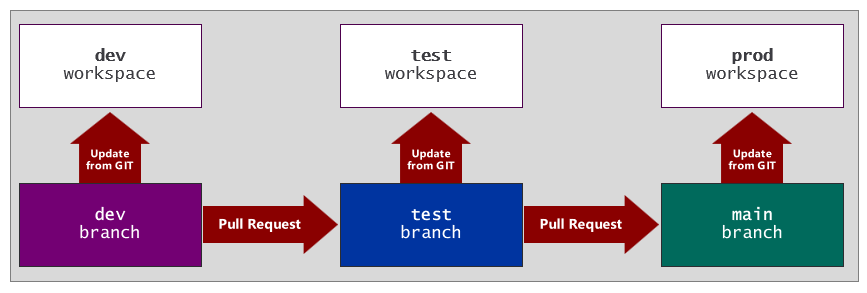

There are two important issues to consider when deciding whether to
build a release process using GIT synchronization. First, there are
issues caused by environment-specific settings that have been committed
to GIT. For example, the datasource location for semantic models in the
**dev** workspace will be committed to GIT and then propagated to
semantic models in the **test** workspace and the **prod** workspace.
That means you need to run a script after an **Update from GIT**
operation completes to update each semantic model with the datasource
path that is appropriate for its target environment.

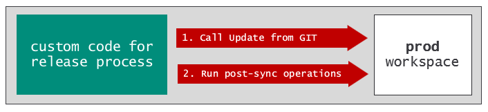

A second issue with GIT synchronization is that it requires a connection
between the target workspace and a GIT branch. When a workspace is
connected to a GIT branch, the Fabric user interface lights up the
workspace with indicators and messages to control and monitor GIT
synchronization. For example, the workspace summary page displays the
**Status** column with values such as **Synced** or **Update required**
which you might prefer to hide from users in a production workspace.

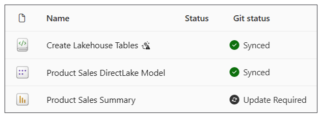

The third option for building a release process is using an API-driven
approach. Using an API-driven approach has become increasingly popular
because it offers significant advantages over the other two choices. For
example, API-driven approach is much better from a performance
perspective because it can scale to accommodate larger project in which
workspaces contains 100s of items.

Using an API-driven release process also provides the flexibility to use
whatever GIT branching strategy your organization prefers. Some
organizations prefer using a GitFlow branching strategy while other
organizations have standardized on trunk-based development. Once you've
chosen a branching strategy, you can then adapt an API-driven release
process to accommodate it.

In theory, you could spend the time and energy required to implement a
release process using the Fabric REST APIs. However, this would require
a non-trivial coding effort. Fortunately, there's a much better option
to build a release process which is leveraging the **fabric-cicd**
library. You will learn about the **fabric-cicd** library in greater
depth in the next section. Before that, we'll examine how the
**fabric-cicd** library can be used with popular branching strategies.

Consider the release process shown in the following screenshot which
uses a GitFlow branching strategy. The **dev** branch serves as
integration branch. This release process uses pull requests to push
changes to **test** and **main** which serve as release branches. The
use of pull requests makes it possible to configure manual approval
processes and to trigger workflows that runs when a pull request
completes. When a pull request completes and merges its changes to one
of the release branches, a workflow runs automatically and implements
the release process by using **fabric-cicd** to deploy changes to the
target workspace.

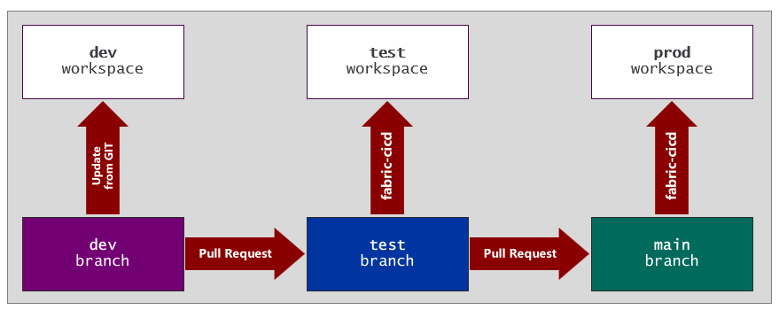

This example is similar to Git synchronization example shown earlier in
the sense that they both use the GitFlow branching strategy. However,
there are significant benefits in using **fabric-cicd** over GIT
synchronization when building a release process. The first benefit is
that **fabric-cicd** supports parameterization which makes it possible
to dynamically update environment-specific settings as part of the
deployment process. Compare this to GIT synchronization which pushes
these types of environment-specific settings to items in the target
workspace which then requires additional automation after an **Update
from GIT** operation completes to apply a fix.

Now let's examine building a release process using a different branching
strategy. Consider a scenario in which an organization has standardized
on trunk-based development using a branching strategy based on a single
long-lived branch. The following diagram show a release process in which
the **main** branch acts as both the integration branch and the release
branch. The **fabric-cicd** library provides the flexibility of building
a release process with a one-to-many mapping between a release branch
and multiple target workspaces.

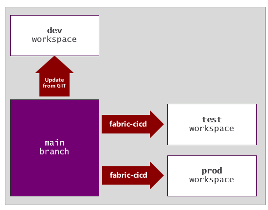

When building a release process, you are often required to configure a
manual approval process in which one or more approvers need to sign off
on a release before it's deployed to a target workspace. When using a
GitFlow branching strategy, it's easy because you can configure pull
requests with whatever manual approval process is required. However,
things are not as obvious when using trunk-based development because the
release process doesn't involve pull requests.

Fortunately, Azure DevOps and GitHub provide another way to configure a
manual approval process without using pull requests. The way to
accomplish this is by extending a GIT repository by creating
environments. An environment in a GIT repository acts as a deployment
target which can be configured with a manual approval process. When you
run a workflow that targets an environment which has been configured
with a manual approval process, the workflow is paused until the
approval process completes. Once the approval is complete, the workflow
resumes and can use the **fabric-cicd** library to deploy the new
release to the target workspace.

### The fabric-cicd library

**fabric-cicd** is an open-source Python library designed by Microsoft
to enable code-first deployment. Code-first deployment is based on the
idea that you can create the single source of truth for a Fabric
solution by assembling a set of item definitions. Once you've assembled
the item definitions for a Fabric solution in a root folder, you can
then use these item definitions as templates to deploy a matching set of
items to a target workspace.

While **fabric-cicd** is an open source project, it's officially
supported and recommended as a best practice by the Fabric product team.
You can have confidence that **fabric-cicd** will continue to evolve
along with the Fabric platform.

A stated goal of the **fabric-cicd** project is to assist CI/CD
developers who prefer not to interact directly with the Fabric REST
APIs. You will find that running a deployment job with **fabric-cicd**
only requires a few lines of code. However, the logic this library
provides is quite mature as its been continually refined over the last
few years. Let's walk through a few examples of how **fabric-cicd**
works internally to give you an appreciation for how much work it does
on your behalf.

To run a deployment job using **fabric-cicd**, you must supply two
important input parameters. The first parameter points to a root folder
containing items definitions. The second parameter references a target
workspace. When you start a deployment job, **fabric-cicd** starts by
enumerating through the root folder to discover every item definition
including those item definition in child folders. For each item
definition that **fabric-cicd** discovers, it must run a check on the
target workspace to determine whether a matching items already exists.
This check is required so **fabric-cicd** can decide whether to create a
new item or to update an existing item.

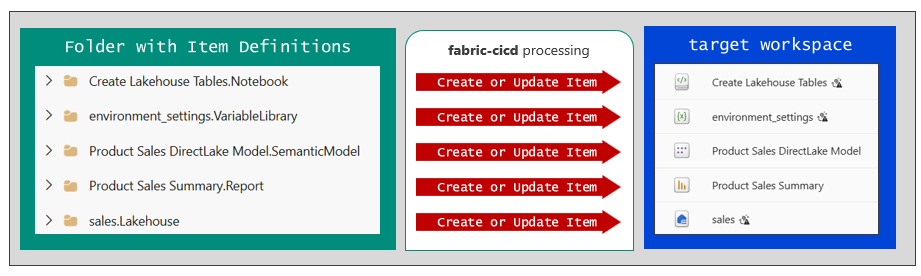

**fabric-cicd** is able to automatically reestablish relationships for
items that support auto-binding. The **fabric-cicd** library implements
auto-binding behavior in a manner similar to GIT synchronization by
using the **logicalId** found in the platform file of an item
definition. When a **fabric-cicd** deployment job runs, it uses the
**logicalId** to map out and rebind item dependencies between items in
the target workspace.

When **fabric-cicd** runs a deployment job, it processes items in a
specific sequence to deal with item dependencies. After all,
**fabric-cicd** cannot create an item with a dependency until after it
has created the items on which it depends. As an example, notebooks can
have dependencies on lakehouses. Pipelines can have dependencies on
lakehouses and on notebooks. The **fabric-cicd** deals this dependency
tree using a sequence which deploys lakehouses first followed by
notebooks and then pipelines. The **fabric-cicd** library even includes
logic to detect whether any pipelines have dependencies on other
pipelines. The sequencing ensures that pipelines with dependencies are
always deployed after other pipelines on which they depend.

Now that understand how **fabric-cicd** works, let's more ahead and walk
through an example running a deployment job. You can start by adding a
pair of YAML files to the same root folder which holds the item
definitions for a Fabric solution. The first file named **deploy.yml**
allow you to configure settings for **fabric-cicd** deployment jobs. The
second file named **parameter.yml** is used to configure
parameterization to deal with environment-specific setting that have
been committed to GIT.

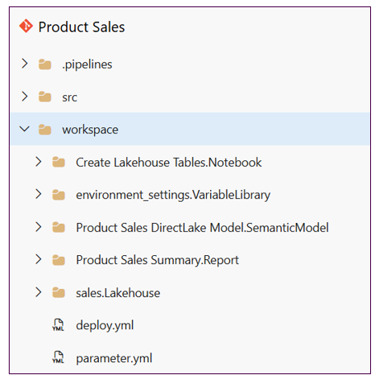

Let's walk through a simple example of configuration-based deployment
using **fabric-cicd**. We'll start by examining the contents of a simple
configuration file named **deploy.yml**. The YAML content contains a
top-level key named **core** which has child keys named
**workspace_id**, **repository_directory**, **item_types_in_scope** and
**parameter**. Underneath the **workspace_id** key, there are two
subkeys named **test** and **prod** which define target environments for
a deployment job.

core:

workspace_id:

test: "400c3329-53b6-415d-a663-d7f1ec73c171"

prod: "c1932962-8236-4375-ad3b-0f3a14dc4c13"

repository_directory: ","

item_types_in_scope:

\- VariableLibrary

\- Lakehouse

\- Notebook

\- DataPipeline

\- SemanticModel

\- Report

parameter: "parameter.yml"

Targets environments are an important concept when using
**fabric-cicd**. The configuration shown in this example defines two
target environments named **test** and **prod**. The configuration maps
each environment to a target workspace using a unique **workspace_id**
value. Whenever you start a deployment job, you must pass a parameter
indicating which environment you want to target. You will experience an
error if you try to start a deployment job using an environment name
hasn't been defined in **deploy.yml**.

**fabric-cicd** provides special treatment when deploying variable
libraries. If your solution contains a variable library, **fabric_cicd**
will always deploy it first before any other items that depend on it.
After creating a variable library, **fabric-cicd** goes one step further
making it possible to activate a specific value set. You should be aware
that value set activation requires you use matching names between
environment passed to **fabric-cicd** and the name of the value set to
be activated. If you run a **fabric-cicd** deployment job with a target
environment name such as **test** or **prod**, you must ensure the
variable library also contains value sets with the matching names of
**test** or **prod**.

Now let's walk through writing the Python code required to start a
**fabric-cicd** deployment job. First, you must install the
**fabric-cicd** library which is available in the **Python Package Index
(PyPI).** That means you can install **fabric-cicd** using the **pip
install** command.

pip install fabric-cicd

The **fabric-cicd** library is commonly used to build release processes
in workflows that run in Azure DevOps or in GitHub. Fortunately, the
ability to install on demand using **pip install** makes it easy to
integrate **fabric-cicd** with Azure pipelines or GitHub Custom Actions.

The following Python code demonstrates how few lines of code it takes to
run a deployment job with **fabric-cicd**. First, you need to create
credentials to authenticate with an Entra Id security principal. This
example demonstrates authenticating as service principal using
credentials stored in environment variables. You start a deployment job
by calling the **deploy_with_config** function and passing parameter
values for **token_credential**, **config_file_path** and
**environment**.

from azure.identity import ClientSecretCredential

from fabric_cicd import deploy_with_config

\# create credentials to authenticate as service principal

spn_credential = ClientSecretCredential(

 tenant_id = os.getenv('AZURE_TENANT_ID'),

  client_id = os.getenv('AZURE_CLIENT_ID'),

  client_secret = os.getenv('AZURE_CLIENT_SECRET')

\# deploy to test workspace

deploy_with_config(

token_credential = spn_credential,

config_file_path = './workspace/deploy.yml',

environment = 'test'

)

\# deploy to prod workspace

deploy_with_config(

token_credential = spn_credential,

config_file_path = './workspace/deploy.yml',

environment = 'prod'

)

When calling **deploy_with_config**, you must pass an **environment**
value which maps to target environment defined in **deploy.yml**. The
environment name determines the id of the target workspace. The ability
to define multiple deployment targets in configuration is powerful
because it allows you to build a release process with a one-to-many
mapping between a single release branch and multiple target workspaces.
The previous code listing demonstrates how easy it is to switch between
deploying to the **test** workspace and the **prod** workspace. You just
need to pass a different environment name when calling
**deploy_with_config**.

Now it is time to examine the **fabric-cicd** support for
parameterization which makes it possible to dynamically update settings
in item definition files during a deployment job. This parameterization
support is essential because it provides a reliable way to deal with
environment-specific settings that have been committed to GIT.

Consider an example of a semantic model that connects to an Azure
storage account but requires different datasource paths for the three
environments **dev**, **test** and **prod**. The problem is that the
datasource path for the semantic model in the **dev** workspace is
committed to GIT in the integration branch. Parameterization is required
to ensure that the semantic models in the **test** workspace and the
**prod** workspace are updated with their environment-specific
datasource paths.

The following YAML listing demonstrates configuring **parameter.yml**
with find-and-replace operation. There is a top-level key named
**find_replace** with nested keys named **find_value** and
**replace_value**. The **find_value** key is assigned a string value
from the **dev** workspace that you want to replace. The
**replace_value** key contains a nested key-value pair for each target
environment. In this example, the configuration defines two target
environments named **test** and **prod**.

find_replace:

\- find_value: "https://storage4dev.dfs.core.windows.net/productsales/"

replace_value:

test: " https://storage4test.dfs.core.windows.net/productsales/"

prod: " https://storage4prod.dfs.core.windows.net/productsales/"

By default, **fabric-cicd** processes a **find_replace** operation by
inspecting every file in every item definition whose type is include in
the **item_type_in_scope** property setting. This can lead to longer
processing times in scenarios in which you have a large number of items
or you have item definitions such as a semantic model with a large
number files.

To optimize performance, **fabric-cicd** parameterization allows you to
define filters to control which items and files are examined during a
replacement operation. For example, you can extend the **find_value**
key by adding filtering keys such as **item_type**, **item_name** and
**file_path**. The following configuration demonstrates how to filter a
**find_replace** operation to restrict processing to a single file named
**expressions.tmdl** found in the item definition for a single semantic
model identified by its display name.

find_replace:

\- find_value: "https://storage4dev.dfs.core.windows.net/productsales/"

replace_value:

test: " https://storage4test.dfs.core.windows.net/productsales/"

prod: " https://storage4prod.dfs.core.windows.net/productsales/"

item_type: "SemanticModel"

item_name: "Product Sales Imported Model"

file_path: "/definition/expressions.tmdl"

The parameterization support in **fabric-cicd** goes beyond adding
simple find-and-replace operations. **fabric-cicd** also supports
parameterization using regular expressions and dynamic variables. In
order to demonstrate these advanced parameterization capabilities, let's
examine a common scenario in which a semantic model is designed to
connect to the SQL endpoint of a lakehouse in the same workspace. This
scenario requires parameterization because each semantic model requires
a uniuqe datasource path to references the SQL endpoint for the
lakehouse in the same workspace.

The item definition for the semantic model includes an
**expressions.tmdl** file which connects to the SQL endpoint using a
call to the PowerQuery function name **SQL.Database**. The
**SQL.Database** function accepts two parameters. The first parameter is
for the SQL endpoint server path and second parameter references a
lakehouse.

Sql.Database(\<SQL Endpoint Connect String\>,
"12341234-1234-1234-1234-123412341234")

Let's start by looking at the second parameter passed to
**SQL.Database** which is used to identify the target lakehouse. For
this lakehouse parameter, you can pass the either the lakehouse id or
the lakehouse display name. Using the lakehouse id is problematic
because it will always be different across envorinemnts requiring
additional parmeterization. Instead, you should always pass the
lakehouse name instead of the lakehouse id. That's because the lakehouse
name will be the same across all environments eliminating the need for
parametization.

Sql.Database(\<SQL Endpoint Connect String\>, "sales")

Now let's turn our attention to the first parameter passed to
**Sql.Database**. This parameter is used to pass the SQL endpoint
connect string which ends with **.datawarehouse.fabric.microsoft.com** .
However, the first part of the SQL endpoint connection string is always
unique to a specific workspace which means. Therefore, dealing with the
SQL endpoint connection string requires parameterization.

Sql.Database(4zzdkw4hunvuhp4ttpl5hvkkzm-6pexp5fkuvjedkrx773mxow6z4.datawarehouse.fabric.microsoft.com,

**fabric-cicd** supports parameterization using regular expressions to
identity capture zones used in **find_replace** operations. The
following regular expression demonstrates defining a capture zone for
the SQL endpoint connection string.

Sql\\Database\\\s\*"(\[^"\]\*datawarehouse\\fabric\\microsoft\\com\[^"\]\*)"\s\*,

Once you have created the regular expression with a capture zone to
replace the SQL endpoint connection string, you can use it in a
**find_replace** operation as long as you add an **is_regex** key with a
value set to true.

find_replace:

\- find_value:
'Sql\\Database\\\s\*"(\[^"\]\*datawarehouse\\fabric\\microsoft\\com\[^"\]\*)"\s\*,'

replace_value:

test: \$items.Lakehouse.sales.\$sqlendpoint

prod: \$items.Lakehouse.sales.\$sqlendpoint

is_regex: "true"

item_type: \["SemanticModel"\]

file_path: "\*\*/expressions.tmdl"

In addition to demonstrating the use of a regular expression with a
capture zone, this example also uses a dynamic variable for the
**replace_value** key. The dynamic variable is created to reference the
lakehouse names **sales** using the syntax **\$items.Lakehouse.sales**.
In this example, the **\$sqlendpoint** property of the dynamical
lakehouse variable is used to provide the replacement value.

There is one final improvement that can be made to this example. In the
previous listing, you can see that both environments use the same
dynamic variable expression as the **replace_value**. In a scenario like
this in which all environment keys have the same value, you can use the
**\_ALL\_** key instead of adding multiple environment keys with
redundant values.

find_replace:

\- find_value:
'Sql\\Database\\\s\*"(\[^"\]\*datawarehouse\\fabric\\microsoft\\com\[^"\]\*)"\s\*,'

replace_value:

\_ALL\_: \$items.Lakehouse.sales.\$sqlendpoint

is_regex: "true"

item_type: \["SemanticModel"\]

file_path: "\*\*/expressions.tmdl"

This example demonstrates the power of configuring parameterization
using regular expressions, capture zones and dynamic variables. Keep in
mind you can use dynamical variables to obtain the id for any type of
workspace item. You can also use a dynamic **\$workspace** variable
which provides the **\$id** property and the **\$name** in cases in
which you need to obtain the id or name of the current workspace.

Resource for learning more about fabric-cicd

- [Home page](https://microsoft.github.io/fabric-cicd/0.1.7/)

- [Code
  Samples](https://microsoft.github.io/fabric-cicd/0.1.7/code_sample/)

- [Code
  Reference](https://microsoft.github.io/fabric-cicd/0.1.7/code_reference/)

- [Parameterization](https://microsoft.github.io/fabric-cicd/0.1.33/how_to/parameterization/)

### Data orchestration

Fabric provides rich support for building data-centric solutions. This
support is built on top of one set of workspace item types that act as a
data containers and a complimentary set of workspace item types which
focus on running ETL processes and data integration. When designing a
Fabric solution with a data container item such as a lakehouse, you must
plan how to build and run a ETL logic to populate the lakehouse. You can
choose between several different types of ETL-focused item types such as
notebooks, pipelines, copy jobs, user-defined functions. Dataflows and
Spark Job Definitions.

This guidance does not intend to provide in-depth coverage of how to
build and optimize ETL processes in Fabric or how to choose between
notebooks versus pipelines versus dataflow. Instead, this guidance calls
out a few general best practices for designing the ETL logic in a Fabric
solution that you intend to deploy to multiple target environments.

It is a best practice to author and maintain the ETL logic for a Fabric
solution using workspace items that are part of the same solution. When
you build ETL logic using workspace items such as notebooks or
pipelines, the ETL logic can be tracked in a GIT branch and versioned
over time along with all other items in the Fabric solution. For this
reason, it's recommended that you avoid designing Fabric solutions that
depend on external ETL processes or scripts that are not part of the
current solution.

Another essential best practice is to plan a data orchestration strategy
to populate items that act as data containers such as a lakehouse. The
goal is to is design a set of ETL-based items to automate data
ingestion, transformation and persistence as part of the solution
deployment process. Let's examine why having this type of strategy is
important.

As you know, you have several different options for deploying a Fabric
solution with a lakehouse to a target workspace. One option is to deploy
the Fabric solution from one workspace to another using a deployment
pipeline. A second option is to deploy the Fabric solution when
branching out to a feature workspace using an **Update from GIT**
operation. A third option is to deploy the Fabric solution using the
**fabric-cicd** library. Whichever of these three options you choose,
the deployment result will always be the same. The lakehouse is created
as an empty data container which requires your attention.

Let's walk through an example of data orchestration in a Fabric solution
shown in the following diagram. This solution is designed with a
medallion architecture in which data flows across three lakehouses which
serve as storage for the bronze, silver and gold layers. The bronze
lakehouse is designed with an ADLS Gen2 shortcut to enable access to
data files in an Azure storage account container. There is one notebook
which builds the silver layer by loading the data files from the bronze
lakehouse and persisting them as delta tables in the silver lakehouse.
There is second notebook which builds the gold layer by loading tables
from the silver lakehouse and transforming them into a star schema
before saving them as delta tables in the gold lakehouse.

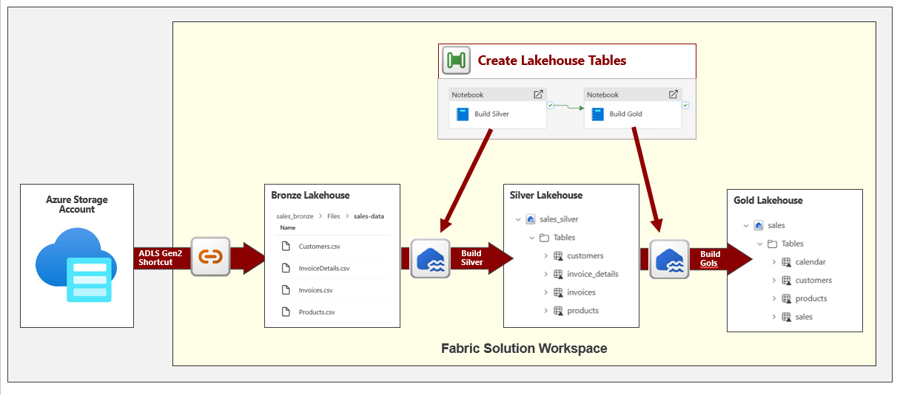

An important aspect of this data orchestration design is that it exposes
a top-level pipeline named **Create Lakehouse Tables**. When you run
this pipeline, it runs the two notebooks in sequence to execute all the
necessary ETL logic to populate all lakehouses with data. After you
deploy this Fabric solution which creates lakehouses in an empty state,
you can then automate running this pipeline to execute the data
orchestration which moves the workspace into a state where it's ready
for use.

To summarize this best practice, a Fabric solution should expose a
single item with top-level ETL logic which can be run to populate data
container items with data. Whether you implement a data orchestration
strategy using notebooks versus pipelines versus something else is up to
you. What's important is that when you first deploy a Fabric solution,
you can follow up deployment by running a single job with the data
orchestration required to prepare the workspace so it's ready for users.
When a Fabric solution includes a top-level notebook or pipeline, you
can automate running it after a deployment using **fabric-cicd**.

When designing a data orchestration strategy, you must also consider
data refresh requirements. Think about what happens after the initial
deployment once data container items have been populated with data for
the first time. How do you plan to keep the data in a lakehouse up to
date? The recommended approach is to automate the processes for
refreshing data using scheduled jobs.

For example, you could schedule a pipeline that processes a full data
refresh to run once a day while designing another pipeline with
incremental refresh logic to run as a scheduled job to run every 15
minutes. The key point is that adding scheduled jobs should be part of
the data orchestration plan because it enables a Fabric solution to
self-manage all its data refresh requirements.

Fabric makes it possible to extend the item definition of notebooks and
pipelines using a **.schedules** file. The **.schedules** file contains
JSON content with a **schedules** element containing a list of one or
more scheduled jobs. By extending the item definitions for ETL items in
a Fabric solutions with **.schedules** files, you can automate the data
refresh strategy for a Fabric solution.

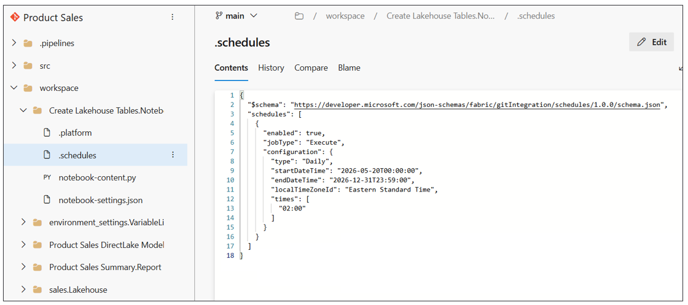

One final issue to consider with data orchestration is how to address
changes to schemas over time. Think about a scenario where need to
update the table schema for a lakehouse that's already been deployed and
populated with data. Pushing out table schema changes to a lakehouse is
challenging because Fabric doesn't track any metadata for the table
schema in the underlying item definition for a lakehouse. The most
common way to update the table schema for a lakehouse is a run a
notebook with procedural programming logic to add and remove tables and
table columns.

Now imagine you begin working in a feature workspace to write code in a
notebook to update the lakehouse table schema. First, you write the code
and test it using a lakehouse in the feature workspace. After than, you
commit your changes to GIT and use a pull request to push the notebook
to the integration branch. Now you can use an **Update from GIT**
operation to push the notebook to the **dev** workspace. Likewise, you
can use **fabric-cicd** to push the notebook to the **test** workspace
or the **prod** workspace. However, just pushing the notebook to the
workspace with the lakehouse is not enough. You still need to actually
run the notebook in the target workspace to update the lakehouse schema.

Managing schema and pushing schema changes with Fabric warehouse is much
different than lakehouse. The best practice for implementing CI/CD
processes with a warehouse schema is using SqlPackage and DacFx.

### Fabric REST API Programming

Fabric offers several developer tools and libraries that are effective
in boosting your productivity. You have seen examples of Terraform,
Fabric CLI, Semantic Link Labs and **fabric-cicd** which hide many of
the low-level details associated with authentication, acquiring access
tokens and executing HTTP requests. However, you might encounter
scenarios in which you need a greater degree of control. This can be
achieved by programming the Fabric REST API to execute API calls using a
familiar programming language such as C# or Python.

This guidance recommends using Terraform to create infrastructure in
larger Fabric CI/CD projects. But there could be factors that make you
decide against using Terraform in a particular Fabric CI/CD project. As
an alternative, you can write automation scripts which call the Fabric
REST APIs to create tenant-level Fabric items such as workspaces,
connections, gateways and deployment pipelines. Using Fabric REST APIs
also makes it possible to fully automate the process setting up GIT
integration for a Fabric CI/CD project. This is achieved by creating a
GIT source control connection and then using that connection to bind
workspaces to GIT branches.

Programming the Fabric REST APIs provides the richest support for
managing the lifecycle of workspace items. This is due to the ability to
work directly with items definitions when calling CRUD APIs to create
and update workspace items. This makes it possible to deploy a Fabric
solution to a target workspace using a repeatable process which ensures
workspace items are created with the correct relationships to other
items in the same workspace. For example, you can create a lakehouse and
a notebook in such as way that the notebook is configured to use the new
lakehouse as its default lakehouse.

The Fabric REST APIs can be used to control GIT synchronization. There
is an **Update From Git** API which can be used to initialize or update
a feature workspace from an underlying GIT branch. It's also common to
call **Update From Git** on the **dev** workspace to synchronize changes
merged from feature branches to the integration branch. There is a
complimentary **Commit To Git** API used in scenarios in which you need
to automate the commit operation to push workspace item changes to its
underlying GIT branch.

If you decide to program directly against the Fabric REST APIs, there
are a few fundamental you need to learn right away. The Fabric REST APIs
are built upon three essential concepts which are **paginated results**,
**long-running operations (LRO)** and **throttling**. Developers who
choose to program the Fabric REST APIs must understand these concepts in
order to write code that is correct and reliable. Fortunately, this is
something you don't have to worry about when using developer tools such
as Terraform and Fabric CLI which deal with paginated results,
long-running operations and throttling behind the scenes.

Fabric REST API Fundamentals

- [The Fabric REST
  APIs](https://learn.microsoft.com/en-us/rest/api/fabric/articles/)

- [Fabric GIT
  APIs](https://learn.microsoft.com/en-us/rest/api/fabric/core/git/connect?tabs=HTTP)

- [Pagination](https://learn.microsoft.com/en-us/rest/api/fabric/articles/pagination)

- [Long running
  operations](https://learn.microsoft.com/en-us/rest/api/fabric/articles/long-running-operation)

- [Throttling](https://learn.microsoft.com/en-us/rest/api/fabric/articles/throttling)

Microsoft offers two Software Development Kits (SDKs) for the Fabric
REST APIs. Microsoft provides a **Microsoft Fabric .NET SDK** for C#
developers and a **Microsoft Fabric Python SDK** for Python developers.
These SDKs provide a productivity boost by hiding low-level details for
executing HTTP requests, transmitting access tokens and converting back
and forth between JSON and strongly-typed objects. The two SDKs also
provide the convenience of dealing with paginated results, long running
operations and throttling errors behind the scenes.

Let's examine a simple listing showing the traditional 'hello world'
code for using the Fabric Python SDK to create a new workspace. This
code begins by creating a **ClientSecretCredential** object which is
used to authenticate as a service principal. After that, the code
creates a **FabricClient** object named **fabric_client** which exposes
methods to execute calls Fabric REST API endpoints. The code in the
listing creates a workspace by calling **create_workspace**. After that,
the code calls **list_workspaces** and uses the result to enumerate
through the existing set of workspaces.

"""Hello World for Fabric REST API Pythn SDK"""

import os

from azure.identity import ClientSecretCredential

from microsoft_fabric_api import FabricClient

credential = ClientSecretCredential(

tenant_id = os.getenv("AZURE_TENANT_ID"),

client_id = os.getenv("AZURE_CLIENT_ID"),

client_secret = os.getenv("AZURE_CLIENT_SECRET")

)

fabric_client = FabricClient(credential)

\# create request body for creating new workspace

create_workspace_request = {

"displayName": "Hello Python SDK",

"description": "This isn't so hard",

"capacityId": os.getenv("FABRIC_CAPACITY_ID")

}

\# call Create Workspace API

workspace =
fabric_client.core.workspaces.create_workspace(create_workspace_request)

\# enumerate workspaces by calling List Workspaces API

workspaces = fabric_client.core.workspaces.list_workspaces()

for workspace in workspaces:

print(f'{workspace.display_name} - \[{workspace.id}\]')

Fabric REST API SDKs

- [Microsoft Fabric .NET
  SDK](https://www.nuget.org/packages/Microsoft.Fabric.Api)

- Python SDK (coming soon)

Let's examine a Fabric REST API programming scenario in which you need
to deploy a Fabric solution to a target workspace which involves
creating a lakehouse and a notebook. In this scenario, assume you
already have an existing item definition for a notebook and you need to
create the notebook in such a way that it references the new lakehouse
as its default lakehouse. This means you need to update the item
definition file named **notebook-contents.py** with the lakehouse id
before you can use the item definition to create the notebook**.**

There is a timing issue involved in this scenario. You cannot determine
the new lakehouse Id until after the lakehouse has been created. Once
the lakehouse has been created, you must then update the item definition
file **notebook-contents.py** with the Id of the new lakehouse. The best
way to deal with this scenario when programming with the Fabric REST
APIs is loading the item definition files for the notebook into memory.
Once you have loaded the contents of **notebook-contents.py** into
memory, you can update it dynamically before using it to create a new
notebook item. The ability to dynamically update an item definition file
provides a more seamless experience when developing a Fabric solution
where you're required to create a set of workspace items with
dependencies between them.

The Fabric REST APIs offer three primary APIs which involve programming
with item definitions. First, the **Create Item** API allows you to pass
an item definition when creating a workspace item. Second, the **Update
Item Definition** API allows you to pass an item definition when
updating a workspace item. Third, the **Get Item Definition** API allows
you to retrieve the item definition for an existing item.

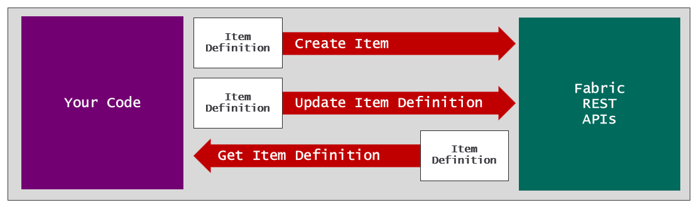

Let's walk through a scenario in which creating a workspace item
requires dynamically updating an item definition file. Imagine you have
just used the Fabric REST API to create a workspace and a lakehouse
inside that workspace. Now it's time to create the notebook. However,
you have to create a notebook in such a way that it's configured to use
the lakehouse as its default lakehouse.

As discussed earlier, the **notebook-content.py** file in the item
definition for a notebook contains metadata which tracks the
configuration of its default lakehouse. The metadata is hidden from
users when the notebook is opened in the web-based notebook editor
provided by the Fabric service. However, you can view this metadata by
examining the raw file contents of **notebook-content.py** file as shown
in the following screenshot.

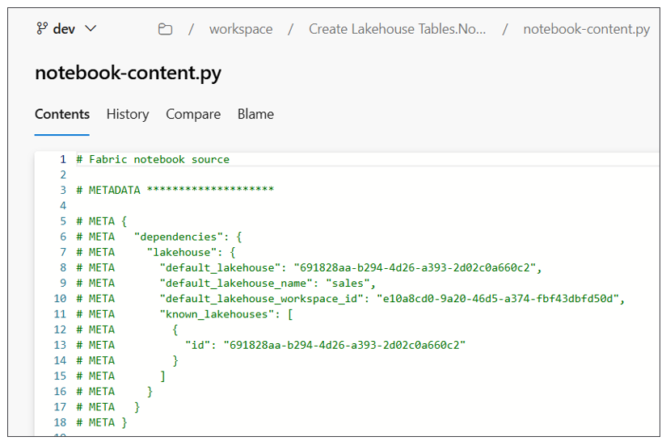

Before calling **Create Item**, you first need to update the contents of
**notebook-content** to include the correct workspace id and lakehouse
id. This means your code must track the ids of the workspace and the
lakehouse as they are created. Once you have determined what the ids
are, you can perform some type of find-and-replace operation to
substitute the workspace id, lakehouse id and lakehouse display name
into the contents of **notebook-content.py**.

\# Fabric notebook source

\# METADATA \*\*\*\*\*\*\*\*\*\*\*\*\*\*\*\*\*\*\*\*

\# META {

\# META "dependencies": {  
\# META "lakehouse": {

\# META "default_lakehouse": "{LAKEHOUSE_ID}",

\# META "default_lakehouse_name": "{LAKEHOUSE_NAME}",

\# META "default_lakehouse_workspace_id": "{WORKSPACE_ID}",

\# META "known_lakehouses": \[

\# META {

\# META "id": "{LAKEHOUSE_ID}"

\# META }

\# META \]

\# META }

\# META }

\# META }

Directly manipulating item definition files is a powerful technique that
assumes you know what you are doing. If you update an item definition
file with invalid syntax, you will experience errors when calling
**Create Item** and **Update Item Definition**.

Now let's walk through the programming steps required to call **Create
Item** using an item definition. First, you need to enumerate through
all the files in the item definition folder and load their contents and
their relative files paths into memory. At this point you can updated
the contents of **notebook-content.py** in memory with the metadata for
the default lakehouse you'd like to use.

The next step is to parse together a JSON payload that allows you to
pass the item definition across the network. Things get a bit tricky
because there's a need to pass the contents of multiple files across the
network in a single HTTP request. The way to accomplish this is to
convert the contents of each file into a base64 encoded format. By
formatting file contents using base64 encoding, you can add the content
of any file into a JSON element as a standard string value. This makes
it possible to transmit all the files required for an item definition
across the network in a call the **Create Item** API.

The following JSON listing shows an example of an HTTP request body that
can be passed across the network in a call to the **Create Item** API.
The **definition** element contains a **parts** collection which
contains a **part** element for each file in the item definition. Each
**part** element includes a relative **path** value and a payload for
the file contents in a base64 encoded format.

{

"displayName": "Create Lakehouse Tables",

"type": "Notebook",

"definition": {

"parts": \[

{

"path": ".platform",

"payload":
"\*\*\*\*\*\*\*\*\*\*\*\*\*\*\*\*\*\*\*\*BASE64-ENCODED-FILE-CONTENT\*\*\*\*\*\*\*\*\*\*\*\*\*\*\*\*\*\*\*\*"

"payloadType": "InlineBase64"

},

{

"path": "notebook-content.py",

"payload":
"\*\*\*\*\*\*\*\*\*\*\*\*\*\*\*\*\*\*\*\*BASE64-ENCODED-FILE-CONTENT\*\*\*\*\*\*\*\*\*\*\*\*\*\*\*\*\*\*\*\*"

"payloadType": "InlineBase64"

},

{

"path": "notebook-settings.json",

"payload":
"\*\*\*\*\*\*\*\*\*\*\*\*\*\*\*\*\*\*\*\*BASE64-ENCODED-FILE-CONTENT\*\*\*\*\*\*\*\*\*\*\*\*\*\*\*\*\*\*\*\*"

"payloadType": "InlineBase64"

}

\]

}

}

At this point, you should be able to make an observation about the
difference between Fabric REST API programming and using Fabric
developer tools and libraries such a Terraform, Fabric CLI or
**fabric-cicd**. Programming the Fabric REST APIs provides more control
but at the expense of significantly more complexity. When you use
Terraform, Fabric CLI or **fabric-cicd**, all the work of formatting
file contents back and forth between base64 encoding and clear text is
handled for you behind the scenes. While these tools and libraries don't
provide as much control, they sure makes things a lot easier.

Consider another convenience provided by Terraform, Fabric CLI and
**fabric-cicd**. You don't have to worry about whether target workspace
items already exists or not because these tools and libraries contain
logic to detect whether a target item already exists. To implement the
same logic with the Fabric REST APIs requires multiple steps. First, you
need to call the **Get Items** API to determine whether the target item
exists. You must follow that with conditional logic which determines
whether to call **Create Item** versus **Update Item Definition**.

Let's examine another common scenario in which you need to program the
Fabric REST APIs to update an existing workspace item. Perhaps you'd
like to update the metadata for an existing notebook to switch its
default lakehouse from one lakehouse to another. You can accomplish this
using the following steps.

- Call **Get Item Definition** to retrieve JSON response with the
  current item definition

- Extract the **notebook-content.py** file content and convert it from
  base64 to plain text

- Perform a find-and-replace operation on **notebook-content.py** to
  update the workspace id and lakehouse id

- Convert the updated file contents for **notebook-content.py** back
  into the base64 encoded format

- Update the JSON element for the item definition with the base64
  encoded content for **notebook-content.py**.

- Call **Update Item Definition** passing the JSON with the updated item
  definition.

Resources for working with item definitions

- [Fabric item definitions
  overview](https://learn.microsoft.com/en-us/rest/api/fabric/articles/item-management/definitions/item-definition-overview)

- [Create Item
  API](https://learn.microsoft.com/en-us/rest/api/fabric/core/items/create-item?tabs=HTTP)

- [Get Item Definition
  API](https://learn.microsoft.com/en-us/rest/api/fabric/core/items/get-item-definition?tabs=HTTP)

- [Update Item Definition
  API](https://learn.microsoft.com/en-us/rest/api/fabric/core/items/update-item-definition?tabs=HTTP)

When you begin to program the Fabric REST APIs, you might notice that it
provides item-generic APIs as well as item-specific APIs. You've already
seen examples of using item-generic APIs such as **Create Item** and
**Update Item Definition**. However, the Fabric REST APIs also offer
item-specific APIs such as **Create Lakehouse** and **Create Notebook**.
This begs the question should you use item-generic APIs or item-specific
APIs.

With respect to creating, updating and deleting workspace items, it
doesn’t really matter whether you use the item-generic APIs or
item-specific APIs because the result will be the same. For this reason,
many developers prefer using item-generic APIs to create and update
workspace items because it allows them to write generic code which can
be reused with any type of workspace item.

The only time where it's essential to use item-specific APIs is when you
need to a query a workspace item to retrieve its properties. As an
experiment, let's compare the results of calling **Get Item** versus
**Get Lakehouse**. A call to **Get Item** results in an HTTP GET request
to a URL which targets the **items** endpoint for a specific workspace.

https://api.fabric.microsoft.com/v1/workspaces/{workspaceId}/items/{itemId}

The response from **Get Item** returns a JSON element which contains
properties common to all types of workspace items.

{

"displayName": "sales",

"description": "Contain for sales data",

"type": "Lakehouse",

"workspaceId": "{LAKEHOUSE_ID}",

"id": "{WORKSPACE_ID}"

}

Now let's compare this to a call to **Get Lakehouse** which uses an URL
targeting the **lakehouses** endpoint for a workspace.

https://api.fabric.microsoft.com/v1/workspaces/{workspaceId}/lakehouses/{lakehouseId}

The response from **Get Lakehouse** includes a **properties** element
with additional properties that are specific to lakehouses.

{

"displayName": "sales",

"description": "Contain for sales data",

"type": "Lakehouse",

"workspaceId": "{LAKEHOUSE_ID}",

"id": "{WORKSPACE_ID}"

"properties": {

"oneLakeTablesPath":
"https://onelake.dfs.fabric.microsoft.com/{workspaceId}-{ItemId}/Tables",

"oneLakeFilesPath":
"https://onelake.dfs.fabric.microsoft.com/{workspaceId}-{ItemId}/Files",

"sqlEndpointProperties": {

"connectionString":
"{SQL_ENDPOINT_UNIQUE_PATH}.datawarehouse.fabric.microsoft.com",

"id": "{LAKEHOUSE_ID}",

"provisioningStatus": "Success"

}

}

}

There is a common scenario in which you need to create a lakehouse along
with a semantic model which connects to that lakehouse using the OneLake
URL or the SQL endpoint. After creating the lakehouse, you need to call
the **Get Lakehouse** API to discover its properties so that you can
update the semantic model with the correct connection settings.

### Bulk Import/Export APIs

**Content not yet available - coming soon!**

## Developing Workflows for Fabric CI/CD

Now that you've seen your options for writing automation logic for CI/CD
processes, the next question to answer is where to deploy that code. The
answer to this question is simple. You want to deploy the code which
runs CI/CD processes in the same GIT repository that holds the item
definitions. The next two sections will introduce the topic of
developing custom workflows in the GIT providers supported by Fabric
which are Azure DevOps and GitHub.

### Developing Azure Pipelines

Azure DevOps is a Microsoft cloud platform that provides a suite of
development tools for software teams to plan, build, test, and deploy
applications. It's designed with CI/CD features to support the entire
software development lifecycle. When you create a new project in Azure
DevOps, the project is automatically created with a GIT repository of
the same name. For example, creating a project named **Product Sales**
will automatically create a repository named **Product Sales**.

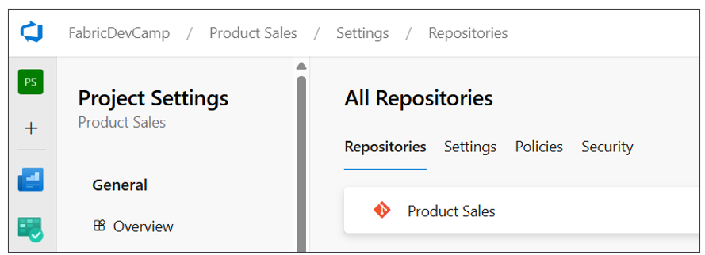

In many scenarios, the GIT repository that's created along with the
project is all you need. However, you can always add additional
repositories to a project if they're needed.

Azure Pipelines is the workflow development platform that's built into
Azure DevOps. Azure pipelines provide the capability to integrate, test
and deploy code using the principals of CI/CD. When you create an Azure
pipeline, you can configured it to run on-demand or on a schedule such
as every night at midnight. Alternately, you can define an Azure
pipeline with a trigger to run automatically in response to a code
commit or the completion of a pull request.

To create an Azure pipeline, you must first add a YAML file with a
pipeline definition into your repository. Once you have added the YAML
file, you must then explicitly register it with the Azure DevOps project
for it to be recognized as an Azure pipeline. This registration can be
accomplished through the Azure DevOps user interface or it can be
automated using the Azure DevOps CLI or the Azure REST APIs. Once a
pipeline has been registered, you should be able to see it in the
**Pipelines** page in an Azure DevOps project.

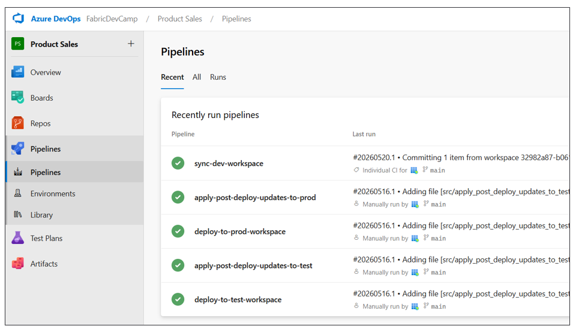

You can write the code for an Azure pipeline in a programming language
such as Python. This is accomplished by referencing a script with Python
code from the YAML file. The following screenshot shows an example of
YAML files for Azure pipelines in the **.pipelines** folder and their
associated Python scripts in the **src** folder. Below these two folders
you can also see the **workspace** folder which contains the item
definitions for a specific Fabric solution.

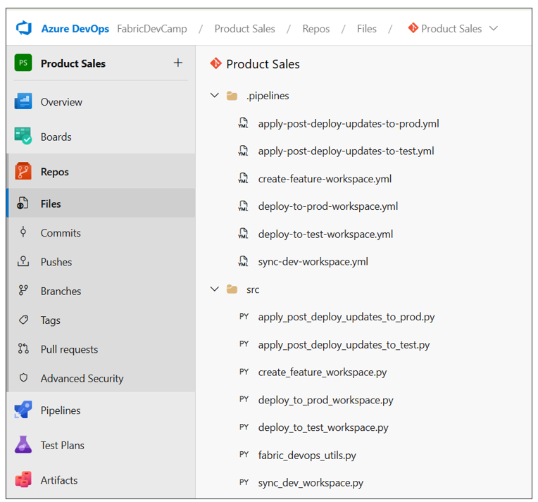

As you begin to develop Azure pipelines for a Fabric CI/CD project, you
will find your code requires access to environment settings such as the
ids for workspaces, capacities, users and groups. You might also need
credentials for an Entra Id application to authenticate as a service
principal. The Azure pipelines service allows you to create variables
and secrets in order to make these types of environment settings
available to the code in your workflows.

The way to create variables and secrets that are accessible to Azure
pipelines is to create a variable group. Once you have created a
variable group, you can then add a set of named variables along with
their values. The following screenshot shows a typical set of variables
and secrets created for Azure pipelines in a Fabric CI/CD project.

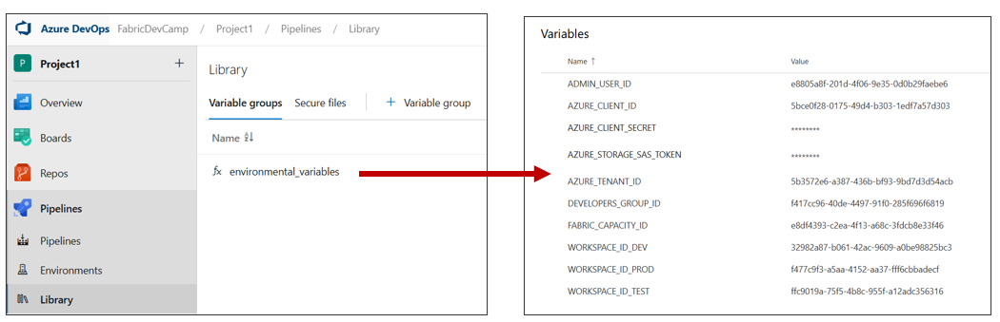

When you create a variable that contains sensitive data, you can mark
that variable as a secret. For example, your pipeline might need to
access to a client secret used to authenticate as a service principal.
When you mark a variable as a secret, the Azure DevOps service does
several important things to protect its value. First, the variable is
persisted in the cloud using an encrypted format rather than plain text.
Second, the value cannot be viewed in the Azure DevOps user interface
after saving. Third, the secret value is masked in logs. If the secret
value appears in pipeline output, Azure Pipelines replaces it with
\*\*\* so it won't be visible to users or in build logs.

Variable groups in Azure DevOps can also be integrated Azure Key Vault.
That means you can configure access to secrets in Azure Key Vault from
code running in an Azure pipeline. This makes it possible to benefit
from Azure Key Vault features such as conditional access policies,
auditing, and secret rotation.

By default, an Azure pipeline does not have access to the variables in a
variable group. Instead, you must configure permissions for a variable
group to ensure the code in your Azure pipelines has access to its
variables and secrets. These permissions can be configured using the
**Pipeline permissions** dialog in the Azure Devops user interface or by
using the Azure DevOps CLI or the Azure REST APIs.

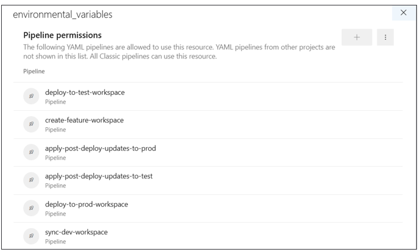

When building a release process using an Azure pipeline, you are often
required to configure a manual approval process. This can be tricky when
using trunk-based development because the release process doesn't
involve pull requests. However, you can solve the problem by creating
environments which can be configured with a manual approval process. As
an example, you can extend an Azure DevOps project by adding two
environments named **test** and **prod**.

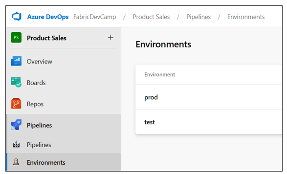

Once you have configured the two environments with a manual approval
process, you can create Azure pipelines for a release process that
target these environments. When you run an Azure pipeline targeting an
environment with a manual approval process, the pipeline job pauses
until the approval process completes. Once the approval is complete, the
pipeline resumes and can use the **fabric-cicd** library to deploy the
new release to a target workspace.

This guidance is intended to get you started developing Azure pipelines
for Fabri CI/CD projects. As you begin to get up to speed on developing
with Azure pipelines, you should become familiar with monitoring
pipeline runs in order to test and debug your code. It's important to
add logging to your code to report on successful operations and to
provide diagnostic information about any errors that occur. The
following screenshot shows how an Azure pipeline can log its progress in
a Fabric CI/CD workflow.

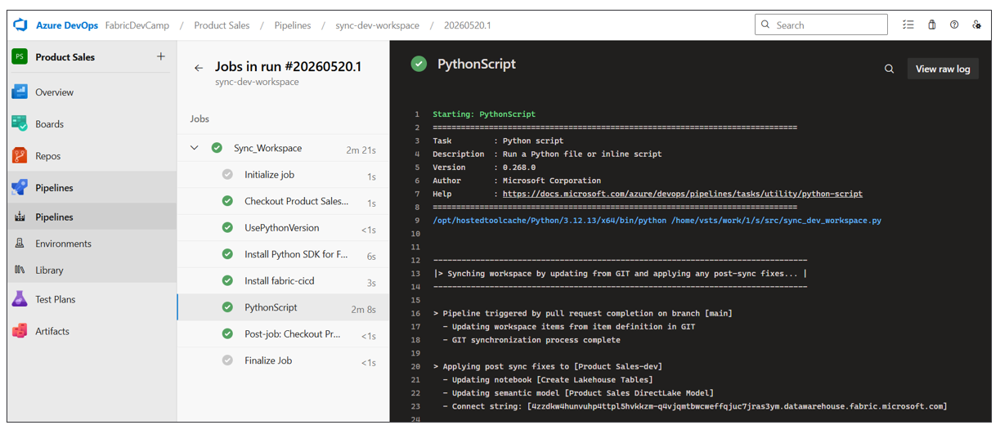

Azure DevOps Pipeline Resources

- [Azure Pipelines
  documentation](https://learn.microsoft.com/en-us/azure/devops/pipelines/?view=azure-devops)

- [Key
  concepts](https://learn.microsoft.com/en-us/azure/devops/pipelines/get-started/key-pipelines-concepts?view=azure-devops)

- [YAML pipeline
  editor](https://learn.microsoft.com/en-us/azure/devops/pipelines/get-started/yaml-pipeline-editor?view=azure-devops)

- [Manage variable
  groups](https://learn.microsoft.com/en-us/azure/devops/pipelines/library/variable-groups?view=azure-devops&tabs=azure-pipelines-ui%2Cyaml)

- [Use Azure Key Vault secrets in Azure
  Pipelines](https://learn.microsoft.com/en-us/azure/devops/pipelines/release/azure-key-vault?view=azure-devops&tabs=managedidentity%2Cyaml)

### Developing GitHub Workflow Actions

GitHub is different from Azure DevOps with respect to how you work with
projects and repositories. GitHub allows you to create repositories
without first creating a project. While GitHub supports creating
projects to assist with organizing repositories, the use of projects in
GitHub is optional. When using GitHub for a Fabric CI/CD project, you
just need to create a repository to get started.

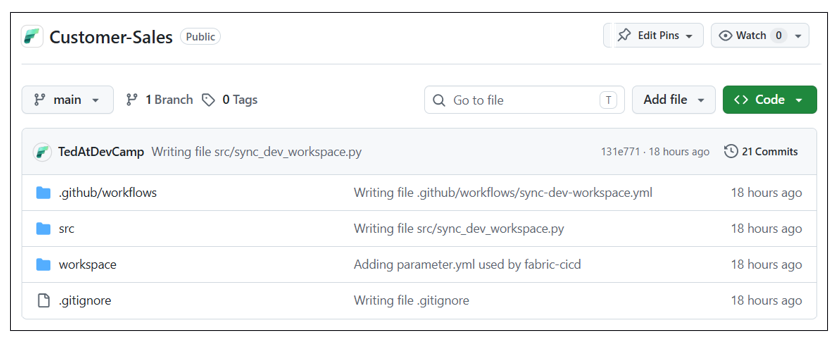

GitHub Actions is the platform in GitHub that allows you to develop
workflows for CI/CD processes. You can create workflows using GitHub
Actions that can be run on-demand or run on a schedule. You can also
configure workflows to run in response to events such as a code commit
or the completion of a pull request.

With GitHub Actions, you create a new workflow by copying a YAML file
with workflow definition into a special repository folder named
**.github/workflows**. Unlike Azure pipelines, there is no need to
register the YAML file with GitHub. Just coping to YAML file into the
**.github/workflows** folder is all you need to do for GitHub to
recognize it as a Workflow Action. Inside the YAML file, it is possible
to reference a script written in a language such as Python. The
following screenshot shows a typical example of the file structure of
workflow files for a Fabric CI/CD project in a GitHub repository.

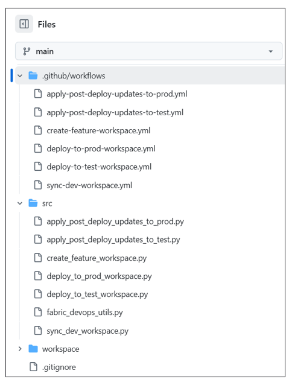

As you begin to develop GitHub Actions for a Fabric CI/CD project, you
need a way to track environment settings such as the ids for workspaces,
capacities, users and groups. Your code might also need authentication
credentials to authenticate as a service principal. GitHub allows you to
create secrets and variables to track these types of environment
settings at two different levels. You can create secrets and variables
at the scope of the repository or at the scope of a specific
environment.

You can create secrets in GitHub at repository scope by navigating to
**Settings** and selecting the **Secrets and variables \> Actions**.
When you create a secret, GitHub will encrypt its value and redact it
from logs. A GitHub Actions workflow decrypts a secret at runtime,
injects it into your workflow and then immediately discards it from
memory when the workflow completes.

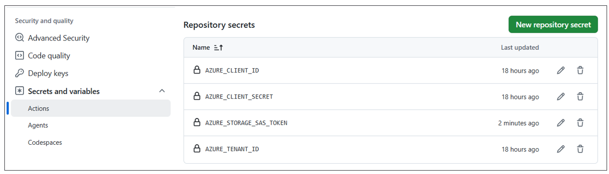

You can also add variables to a GitHub repository for environment
settings that are not sensitive. The following screenshot shows an
example of variables created for Azure pipelines in a Fabric CI/CD
project.

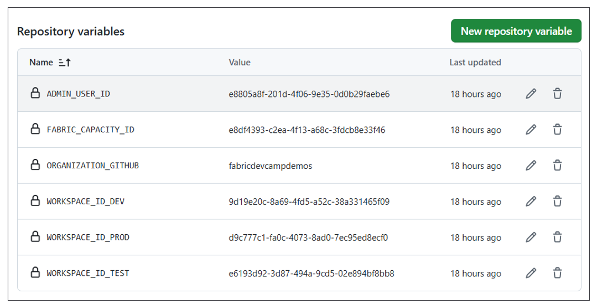

While creating secrets and variables at the repository level is adequate
for some projects, you might find you need more granularity. GitHub
supports a feature which allows you to create environments in a GitHub
repository and then to create secrets and variables at environment
scope.

Consider a CD release process in which workspaces don't exists within
the same Entra Id tenant. For example, imagine the **dev** workspace,
the **test** workspace and the **prod** workspace all exist in different
Entra Id tenants. In this scenario, you will need different
authentication credentials for each Entra Id tenant. You can start by
creating three different environments in your GitHub repository named
**dev**, **test** and **prod**.

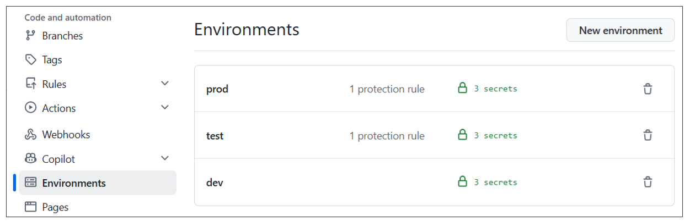

After that, you can configure each environment with the authentication
credentials specific to its Entra Id tenant.

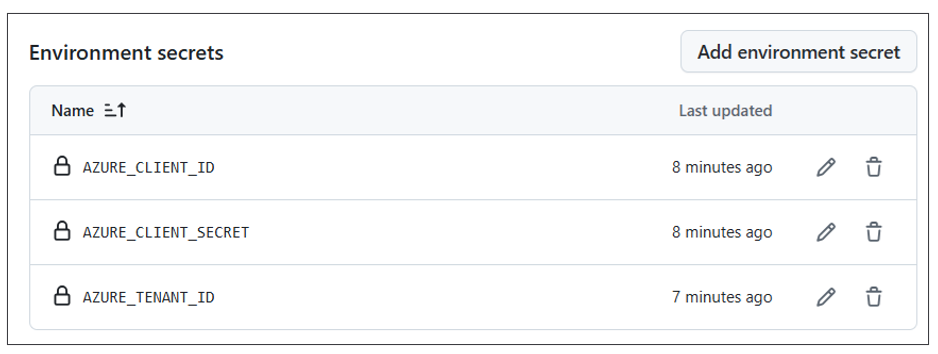

In addition to tracking environment-specific variables and secrets, an
environment can be configured with protection rules. For example, you
can create a protection rule for the **test** environment and the
**prod** environment to require a manual approval process with one or
more approvers. Once you have configured the two environments with a
manual approval process, you can create GitHub Actions for a release
process that target these environments. When you run a GitHub Action
targeting an environment with a manual approval process, the GitHub
Actions job pauses until the approval process completes. Once the
approval is complete, the GitHub Actions job resumes and can use the
**fabric-cicd** library to deploy the new release to a target workspace.

Once you have added the YAML file for a GitHub Actions into the
**.github/workflows** folder, you can view those GitHub Actions in the
left navigation of the **Actions** page. You can also select a workflow
see its run history.

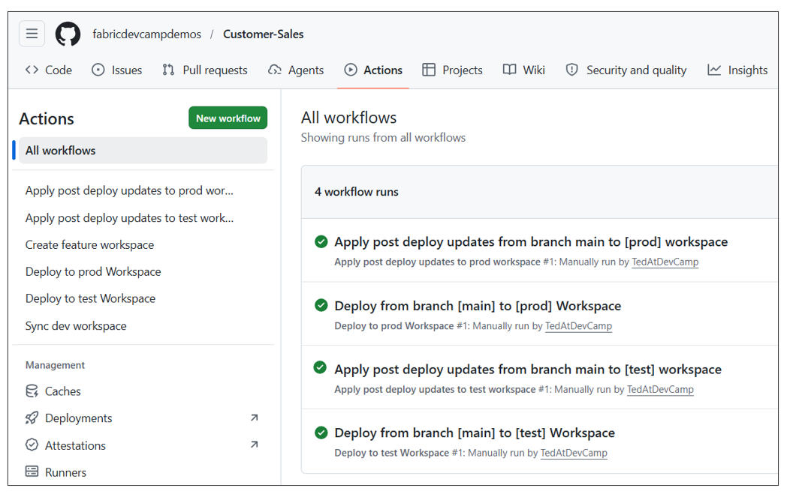

After selecting an action in the left navigation, you can drill into a
specific workflow runs and view its logs. You can also run a action on
demand by dropping down the **Run workflow** menu and clicking the **Run
workflow** button. If you need to collect information from the user
before running the workflow, you can define input fields in the
workflow's YAML file. The following screenshot shows an example of a
workflow with input parameters that prompt the user with a textbox and
two checkboxes.

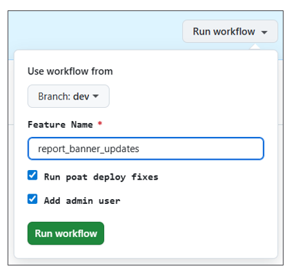

As you begin to develop workflows using GitHub Actions, you should
become familiar with monitoring workflow runs in order to test and debug
your code. It's important to add logging to your code to report on
successful operations and to display diagnostic information about any
errors that occur. The following screenshot shows an example of an
GitHub Action written to log its progress in a Fabric CI/CD workflow.

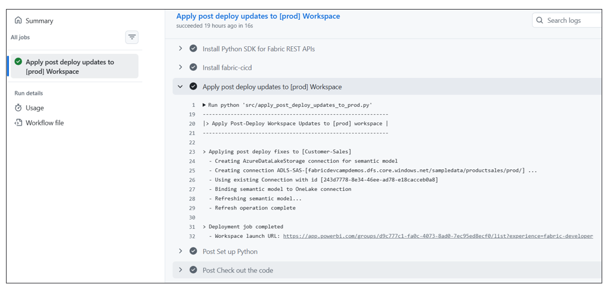

Resources for GitHub Actions Workflows

- [Understanding GitHub
  Actions](https://docs.github.com/en/actions/get-started/understand-github-actions)

- [Workflows](https://docs.github.com/en/actions/concepts/workflows-and-actions/workflows)

- [Variables](https://docs.github.com/en/actions/concepts/workflows-and-actions/variables)

- [Deployment
  environments](https://docs.github.com/en/actions/concepts/workflows-and-actions/deployment-environments)

## Summary

This guidance provided an overview of the Fabric platform's support for
CI/CD. You learned that Fabric GIT integration and the ability to
connect a workspace to a GIT branch provide the foundation for
continuous integration and continuous deployment. Fabric GIT integration
is based on serializing workspace items into item definitions which can
be written to a GIT branch as a set of item definitions. Fabric is also
able to initialize an empty workspace using a set of item definitions in
GIT.

This overview introduced variable libraries which play an essential role
in Fabric CI/CD. Variables libraries allow you to design a
parameterization strategy by creating a set of variables and value sets.
When used correctly, variable libraries help you to avoid writing code
with hardcoded environment settings that change across environments and
workspaces.

You learned there are several different approaches you can take for
automation in a Fabric CI/CD project. You can leverage tools and
libraries like Terraform, Fabric CLI and the **fabric-cicd** library.
You also have the ability to call Fabric REST APIs directly if you feel
the extra degree of control is worth the effort.

This guidance introduced the workflow development environments for Azure
DevOps and GitHub. The development experience in Azure DevOps is based
on Azure pipelines while development experience in the GitHub is based
GitHub Action workflows. Both development environments provide a similar
ability to create workflows using YAML-based files and to provide your
code with access to variables and secrets. You should become comfortable
with writing, testing and debugging code in one of these development
environments if you are the one responsible for automation in a Fabric
CI/CD project.
